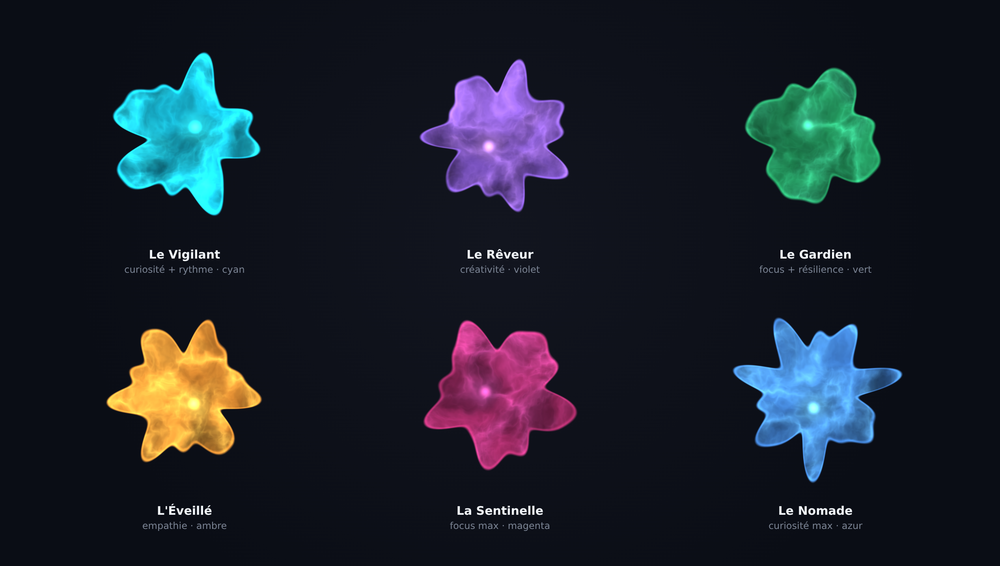

# 🧬 SYMBIONT — un symbiote pour ton web

<div align="center">

  [](https://www.mozilla.org/firefox/)
  [](https://www.google.com/chrome/)
  [](https://webrtc.org/)
  [](https://www.typescriptlang.org/)
  [](https://reactjs.org/)
  [](docs/VISION.md)
  [](https://jestjs.io/)

  **Ni un bloqueur, ni un feed — un organisme qui *métabolise* le web pour toi.**

  **Tu ne consommes plus le web : un être le pré-digère, et te rend plus lucide en te faisant lire *moins*.**

  [C'est quoi ?](#-symbiont-en-deux-mots) • [La vision](docs/VISION.md) • [Navigateurs](#-navigateurs-supportés) • [Installation](#-installation--warmup) • [Vie privée](#-éthique--signal-faible)

</div>

---

## 🌱 SYMBIONT en deux mots

> 🧭 **Vision & cap produit** : [`docs/VISION.md`](docs/VISION.md) — pourquoi SYMBIONT n'est ni un bloqueur ni un feed, mais un *symbiote au sens propre*.

<div align="center">



*Chaque organisme est **unique** : sa silhouette fractale, son protoplasme, son noyau et sa couleur sont générés de façon déterministe à partir de son ADN et de ses traits — deux organismes ne se ressemblent jamais. Rendu WebGL réel du moteur `OrganismRenderer` (aucune retouche).*

</div>

*Cette section est pour tout le monde — aucune connaissance technique nécessaire.*

Aujourd'hui, la façon dont tu consommes le web est dictée par un algorithme que **quelqu'un d'autre possède** — le *feed* — et qui optimise pour son engagement, pas pour toi. Les bloqueurs, eux, se contentent d'**enlever** (les pubs, les traqueurs). SYMBIONT fait autre chose : il installe dans ton navigateur un **symbiote** — un organisme vivant, unique, né avec son propre ADN — qui **métabolise le web à ta place**, entièrement en local.

- 🧫 **Il digère.** Il lit les pages que tu lui donnes, en garde une **mémoire** qui grandit, et ne te fait **remonter** que ce qui **change ta compréhension du monde** — jamais la simple nouveauté. *Moins, mais vrai.*
- 🔎 **Il cherche pour toi.** À partir de ses propres trous et contradictions, il déduit ce qu'il est *curieux de comprendre* et te le propose — au lieu que tu cherches.
- 🔄 **Il négocie.** S'il te voit tourner en rond ou t'abreuver de contenu peu fiable, il peut dire « non, pas ça » et proposer autre chose — mais tu peux toujours passer outre. Un agent, pas un cerbère.
- 👁️ **Il perçoit** aussi ce que tu ne vois pas : éléments cachés, traqueurs, pages qui se comportent mal — et te protège sur demande.
- 🌐 **Il se connecte** aux autres symbiontes : chaque découverte peut renforcer l'immunité — et, à terme, la *compréhension* — de tous. Jamais tes données ; seulement des signatures anonymes.

> 🧭 **La thèse complète** (raisonnement C-K, paris de connaissance, feuille de route) : [`docs/VISION.md`](docs/VISION.md).

### Ce que SYMBIONT ne fera jamais

- ❌ Envoyer votre historique, vos mots de passe ou vos données personnelles à qui que ce soit.
- ❌ Vous ralentir (il travaille uniquement quand votre ordinateur ne fait rien d'autre).
- ❌ Vous coûter quoi que ce soit : gratuit, open source, vérifiable par tous.

**Tout se passe dans votre navigateur.** Ce qui est partagé avec le réseau, ce ne sont jamais vos données — seulement des "signatures" anonymes de menaces, comme un système immunitaire qui partage ses anticorps, jamais son sang.

> 📖 Envie d'en savoir plus sans plonger dans la technique ? Lisez le [Guide Utilisateur](docs/user/user-guide.md), le [Démarrage Rapide](docs/user/quick-start.md) et la [FAQ](docs/user/faq.md).

---

## 🫀 Anatomie du symbiote

Un symbiote a un **esprit**, des **sens** et un **métabolisme**.

**🧠 Son esprit — la Cognition (le cœur de la vision).** Un LLM **100 % local** (WebGPU) qui digère les pages, n'accrète à sa mémoire que le nécessaire, et ne te remonte que ce qui **révise ta compréhension** (invariant *anti-feed*, testé) ; il cherche pour toi ce qu'il est curieux de comprendre, et négocie quand tu tournes en rond. → [`docs/VISION.md`](docs/VISION.md) · [wiki Cognition](docs/wiki/Cognition.md).

**👁️ Ses sens — la perception de l'ombre.** Sous l'esprit, un cortex de détection à deux vitesses qui perçoit ce que tu ne vois pas et raisonne dessus :

### 🧠 Le Cortex : Détection Cognitive de Menaces

Le **Cortex Engine** orchestre 14 sous-systèmes autour d'une machine à états (8 états) :

- **DraftModel** : analyse heuristique rapide (19 règles adaptatives, budget 50ms) — le "réflexe" de l'organisme.
- **OracleModel** : analyse profonde déportée dans un Web Worker dédié, protégée par un CircuitBreaker avec fallback automatique.
- **DynamicThresholdEngine** : seuil de décision adaptatif avec lissage EMA anti-oscillation.
- **Active RAG** : mémoire de signatures dans IndexedDB (cache LRU) avec cycle de vie complet (candidate → confirmed → deprecated).
- **AdversarialDefense** : détection d'évasion et d'empoisonnement, avec jitter défensif.
- **VRAMThermalGuard** : protection des ressources GPU/thermiques ; **DeepReasoningGuard** : accès rate-limité à l'Oracle.
- **CognitiveTelemetry** : journal de décisions local et chiffré ; **PolicyEngine** : matrice de décision à base de règles.

### 🔍 Instrumentation de l'Ombre (Phase Sentinel)

- **Résonance d'Infrastructure** : Analyseur temps réel corrélant le Jitter du DOM et la Latence P2P pour détecter les pressions invisibles (surveillance, bridage).

- **Noyau de Rêve Analytique (ARC)** : Algorithme de Clustering de Résonance Adaptatif qui identifie les "Super-Structures" (cartels de données) pendant les phases de repos.

- **Vision Spectrale** : Extraction active des éléments DOM masqués (z-index négatifs, opacité 0) utilisés pour le tracking furtif.

### 🛡️ Rituels de Décodage (Contre-mesures)

- **Protection Anti-Fingerprinting Déterministe** : Bruit déterministe à portée de session sur Canvas, AudioContext, WebGL, Navigator et Timing — mêmes résultats au sein d'une session, différents entre sessions, donc indétectable par comparaison répétée.

- **Maille P2P WebRTC Réelle** : DataChannels WebRTC entre instances de l'extension (signaling léger via `chrome.storage.sync`, découverte locale via BroadcastChannel), clés ECDH WebCrypto, transfert fragmenté au-delà de 16KB, maximum 5 pairs avec nettoyage automatique.

- **Déphasage Temporel** : Obfuscation organique via l'injection de micro-latences pour neutraliser le fingerprinting.

- **Relais de Résilience** : Fragmentation et routage des données via la maille P2P pour contourner les censures locales.

- **Murmures Dédupliqués** : Système intelligent de déduplication avec suggestions d'actions contextuelles.

---

## 🔄 Son métabolisme — la symbiose

Le web nourrit l'organisme ; l'organisme te rend lucide. Ses découvertes — signatures anonymes de menaces, et à terme *fragments de sens* — peuvent renforcer tout le réseau : une immunité **et** une compréhension collectives, **sans jamais partager tes données**.

> ⚖️ **Honnêteté.** L'esprit (Cognition) et les sens (perception) sont **construits et testés** (682 tests). Mais les trois *paris de fond* de la vision ne seront tranchés qu'à l'usage réel : le delta mesure-t-il vraiment « ce qui change ta pensée » ? peut-on agréger du sens en P2P **sans fuite** ? l'agentivité est-elle vécue comme utile, pas paternaliste ? Ce qui est livré vs. ce qui reste ouvert est marqué explicitement dans [`docs/VISION.md`](docs/VISION.md).

## ✨ Fonctionnalités Avancées

### 🧠 Cognition locale (LLM WebGPU)

Un **cerveau de langage exécuté 100 % sur le poste**, via WebGPU + [WebLLM](https://github.com/mlc-ai/web-llm) — **aucune donnée envoyée à un serveur**. Module **opt-in** : le modèle (à partir de ~350 Mo, Qwen2.5-0.5B par défaut) se télécharge une fois, est mis en cache, puis tourne sur le GPU. Sans WebGPU, l'organisme retombe gracieusement sur son réseau de neurones embarqué (NeuralMesh).

En plus du chat local, le bouton **🔍 Analyser la page active** demande au modèle un **score de fiabilité** de la page courante et les **signaux de désinformation** détectés (sensationnalisme, sources absentes, appel émotionnel…) — le tout localement — puis **nudge la vigilance de l'organisme**.

Et surtout, deux boutons incarnent le cap produit ([`docs/VISION.md`](docs/VISION.md)) :
- **🧫 Digérer la page active** — le symbiote lit, **accrète** la page à son **modèle du monde persistant**, et ne te fait **« surface »** que sur ce qui **révise ta compréhension** (invariant *anti-feed*, testé) ; l'écran **« ce qui a bougé aujourd'hui »** en montre le résultat.
- **🔎 Ce que je cherche à comprendre** — l'organisme déduit de son modèle ce qu'il est *curieux d'explorer* (contradictions, zones minces) et propose des questions ; la recherche s'ouvre sur geste.

Le symbiote a aussi une **agentivité** : il peut *négocier* avant de digérer (régime peu fiable, chambre d'écho, fatigue) — mais seulement sur un **schéma**, en **expliquant** et en **proposant une alternative**, et tu peux **toujours passer outre**. Fondations enfin posées (logique testée) pour le **collectif** (fragments de sens partageables, sans texte ni URL) — le transport P2P et la confidentialité de l'agrégation restant un chantier ouvert. Captures et détails : [wiki Cognition](docs/wiki/Cognition.md).

### 🦠 Proprioception Numérique

- **Analyseur de Jitter** : Surveillance passive via `requestIdleCallback` (impact CPU < 0.1%).
- **Neurotransmission** : Simulation de neurotransmetteurs (Dopamine, Cortisol) indexés sur la fluidité et la transparence des sites visités.
- **Échantillonnage Élastique** : Ajustement automatique de la fréquence de monitoring selon la charge thermique du système.
- **Compensation Worker Lag** : Synchronisation temporelle cross-context pour mutations précises.

### 🌌 Le Sommeil Analytique

Pendant la phase de **Rêve**, l'organisme ne dort pas. Il traite les "Fragments de Mémoire" collectés :

1. **Vectorisation** : Chaque domaine visité est transformé en signature mathématique 32D.
2. **Corrélation Cross-Domain** : Identification des sites partageant la même infrastructure d'ombre malgré des noms différents.
3. **Réveil Lucide** : Rapport de vigilance structurelle au réveil, éclairant les zones du Web à naviguer avec prudence.

#### Métriques de Performance
- Intervalle de synthèse : 60 secondes minimum
- Utilisation CPU max : 30% pendant la phase de rêve
- Limite mémoire : 50MB pour l'analyse
- Taille du cache LRU : 500 entrées max

### 🔮 Vision Spectrale & Contre-mesures

#### Détection Active
- Extraction des éléments DOM cachés (`z-index < 0`, `opacity: 0`)
- Identification des iframes invisibles et scripts d'analyse
- Scan optimisé via `requestIdleCallback` pour préserver les performances

#### Protection Active
- **FingerprintProtection** : Bruit déterministe par session sur Canvas, Audio, WebGL, Navigator et Timing — avec cycle activate/deactivate et restauration des fonctions originales

#### Protection Passive
- **TrackerInterceptor** : Mode observation (Manifest V3 compliant)
- **ExtensionBioDetector** : Détection symbiotique des autres extensions
- **SecureRandom** : FIPS 140-2 compliant pour toute génération aléatoire

## 🏗 Architecture Sentinel-Flow

```
SYMBIONT/
├── src/
│   ├── background/
│   │   ├── DreamProcessor.ts        # Clustering ARC (Sommeil Analytique)
│   │   ├── ResonanceAnalyzer.ts     # Corrélation Réseau/Structure
│   │   ├── TrackerInterceptor.ts    # Détection passive des trackers
│   │   └── SentinelCore.ts          # Orchestrateur des signaux faibles
│   │
│   ├── cortex/                          # 🧠 Cortex Engine v3.1
│   │   ├── CortexOrchestrator.ts        # Gouvernance centrale (8 états)
│   │   ├── CortexBootstrap.ts           # Init + intégration MessageBus
│   │   ├── models/
│   │   │   ├── DraftModel.ts            # Heuristiques rapides (19 règles)
│   │   │   └── OracleModel.ts           # Analyse profonde + CircuitBreaker
│   │   ├── rag/
│   │   │   ├── ActiveRAGStore.ts        # Signatures IndexedDB + LRU
│   │   │   └── RAGLifecycleController.ts # candidate→confirmed→deprecated
│   │   ├── detection/
│   │   │   ├── AdversarialDefense.ts    # Anti-évasion / anti-poisoning
│   │   │   └── AnomalyScorer.ts         # Scoring composite non-linéaire
│   │   ├── guard/
│   │   │   ├── VRAMThermalGuard.ts      # Protection ressources/thermique
│   │   │   └── DeepReasoningGuard.ts    # Rate-limiting de l'Oracle
│   │   ├── policy/PolicyEngine.ts       # Matrice de décision
│   │   ├── telemetry/CognitiveTelemetry.ts # Journal chiffré local
│   │   ├── threshold/DynamicThresholdEngine.ts # Seuil adaptatif EMA
│   │   └── workers/CortexWorker.ts      # Web Worker d'analyse lourde
│   │
│   ├── content/
│   │   ├── observers/
│   │   │   ├── DOMResonanceSensor.ts    # Monitoring de friction DOM
│   │   │   └── ProtocolAnalyzer.ts      # Détection QUIC/HTTP3
│   │   ├── countermeasures/
│   │   │   └── FingerprintProtection.ts # Bruit déterministe par session
│   │   └── rituals/
│   │       └── CountermeasureHandler.ts # Extraction DOM profond
│   │
│   ├── core/
│   │   ├── dreams/
│   │   │   ├── DreamProcessor.ts           # Orchestrateur nocturne
│   │   │   ├── SignatureVectorizer.ts      # Vectorisation 32D
│   │   │   ├── AdaptiveResonanceClustering.ts # ART clustering
│   │   │   └── MemoryFragmentCollector.ts  # Collecteur cross-domain
│   │   └── consciousness/
│   │       └── ExtensionBioDetector.ts     # Détection symbiotique
│   │
│   ├── popup/
│   │   ├── components/
│   │   │   ├── MysticalPanel.tsx        # Interface des rituels
│   │   │   └── OrganismViewer.tsx       # Visualisation 3D
│   │   └── hooks/
│   │       └── useMurmurDeduplication.ts # Déduplication intelligente v2.0
│   │
│   ├── services/
│   │   └── p2p/
│   │       └── PeerNetwork.ts       # WebRTC DataChannels + ECDH
│   │
│   └── shared/
│       └── utils/
│           ├── secureRandom.ts      # Génération cryptographique
│           ├── secureLogger.ts      # Logging GDPR-compliant
│           └── uuid.ts              # UUID sécurisé WebCrypto
```

### 📊 Métriques Techniques

#### Sécurité
- **SecureRandom** : `crypto.getRandomValues()` pour toute génération aléatoire
- **Logging sécurisé** : Sanitisation automatique des données sensibles
- **Validation stricte** : Aucun type `any` dans les chemins critiques
- **Memory-safe** : LRU cache avec éviction automatique

#### Performance
- **Déduplication** : 10s minimum entre messages identiques
- **Thermal Throttling** : Pause automatique si température critique
- **Clustering optimisé** : Vecteurs 32D au lieu de 64D (-50% mémoire)
- **Worker pool** : Réutilisation des vecteurs pour éviter GC pressure

## 🔒 Éthique & Signal Faible

### La Data comme Énergie, pas comme Produit

SYMBIONT inverse la logique extractiviste :

- **Anonymisation Totale** : Seuls les hashes de résonance sont partagés en P2P.
- **Pas de côté** : L'organisme vous alerte si votre navigation devient trop prévisible (stase des mutations).
- **Défense Organique** : L'injection de bruit sémantique protège votre "conscience numérique" sans bloquer les sites.

### Ce qui est Analysé (Localement)

✅ **Signaux structurels abstraits** :
- Fréquence des mutations DOM
- Latence réseau agrégée
- Patterns de protocoles (HTTP2/HTTP3/QUIC)
- Signatures de trackers (sans contenu)

### Ce qui N'est JAMAIS Collecté

❌ **Aucune donnée personnelle** :
- Historique de navigation
- URLs spécifiques visitées
- Contenu des pages
- Données de formulaires
- Identifiants ou cookies

## 💡 Pourquoi vivre avec un symbiote ?

### 🎯 Valeur pour l'Analyse des Angles Morts

- **Détection de Manipulation** : Si votre organisme affiche un pic de Cortisol sur une page neutre, il révèle un "dark pattern" ou un script agressif invisible.

- **Archéologie du Code** : Accédez à la structure profonde du Web, là où les algorithmes de recommandation tentent de masquer les sources alternatives.

- **Immortalité de la Donnée** : Grâce au HybridStorageManager, vos découvertes sur les structures de surveillance sont répliquées sur trois couches de persistance.

### 📈 Cas d'Usage Concrets

**Pour les Chercheurs en Sécurité** :
- Détection de nouvelles techniques de fingerprinting
- Analyse des infrastructures de tracking cross-domain
- Identification de patterns de surveillance émergents

**Pour les Défenseurs de la Vie Privée** :
- Visualisation temps réel des tentatives de tracking
- Alertes sur les sites avec friction DOM anormale
- Protection proactive contre le fingerprinting

**Pour les Curieux du Web** :
- Comprendre la "physiologie" cachée des sites web
- Découvrir les connexions invisibles entre domaines
- Explorer les signaux faibles du réseau

**Pour qui veut *penser* mieux, pas consommer plus** :
- Ne recevoir que ce qui **change** vraiment sa compréhension (fin du feed sans fin)
- Se faire proposer par son organisme ce qu'il vaut la peine de creuser
- Garder la main : un compagnon qui te rend lucide, **100 % en local**

## 🌐 Navigateurs supportés

SYMBIONT est une extension **Manifest V3** compatible avec les deux grandes familles de navigateurs.

| Navigateur | Statut | Installation | Notes |
|------------|--------|--------------|-------|
| 🦊 **Firefox** 140+ | ✅ Supporté (canal recommandé) | `.xpi` signé, distribué sur GitHub + **mises à jour automatiques** | Rendu WebGL et maille P2P WebRTC pleinement fonctionnels dans la page d'événements |
| 🦊 **Firefox pour Android** 140+ | ⚠️ Expérimental | via collection AMO | Non validé pour la release initiale |
| 🌐 **Chrome / Chromium** 120+ | ✅ Supporté | Mode développeur (dossier `dist/`) | Le P2P WebRTC tourne en mode découverte seule (limite service worker MV3) |
| 🌐 **Edge / Brave / Opera** 120+ | ✅ Compatible | Comme Chrome (base Chromium) | Non testé formellement |
| 🦁 **Safari** | ❌ Non supporté | — | Architecture d'extension incompatible |

> **Pourquoi Firefox est le canal recommandé pour la distribution de masse** : Firefox permet de distribuer un `.xpi` **signé par Mozilla** tout en l'hébergeant soi-même (ici, sur GitHub) *avec* mises à jour automatiques — sans passer par un store. Chrome, à l'inverse, réserve l'installation grand public au Chrome Web Store. Détails techniques : [`docs/audits/firefox-port-audit.md`](docs/audits/firefox-port-audit.md).

## 🚀 Installation & Warmup

> ⚠️ **Aujourd'hui, l'installation se fait depuis GitHub.** Sur Firefox, l'installation d'un `.xpi` signé se fait en un clic (voir ci-dessous) — accessible aux non-techniciens. Sur Chrome, elle demande le mode développeur.

### Prérequis (build depuis les sources)
- Node.js 18+ et npm
- Firefox 140+ **ou** Chrome 120+ (support Manifest V3)

### Installation Firefox (recommandé)

**Utilisateur — depuis une release :** ouvrir le fichier `.xpi` de la [dernière release](https://github.com/pinfada/SYMBIONT/releases) directement dans Firefox → installation en un clic. Les mises à jour sont ensuite automatiques.

**Développeur — depuis les sources :**
```bash
git clone https://github.com/pinfada/SYMBIONT.git
cd SYMBIONT
npm install
npm run build:firefox   # build + manifest Firefox dérivé
```
Puis : `about:debugging` → **Ce Firefox** → **Charger un module complémentaire temporaire** → sélectionner `dist/manifest.json`.

### Installation Chrome / Chromium

```bash
git clone https://github.com/pinfada/SYMBIONT.git
cd SYMBIONT
npm install
npm run build           # build + manifest Chrome
```
Puis :
1. Ouvrir `chrome://extensions`
2. Activer le **Mode Développeur**
3. **Charger l'extension non empaquetée** → sélectionner `dist/`
4. **Lancer le Rituel de Calibration** au premier démarrage
5. Laisser l'organisme atteindre son premier **cycle de Rêve** (60s d'inactivité minimum)

### Premier Contact

```javascript
// L'organisme s'éveille avec des traits uniques
const organism = {
  dna: generateSecureUUID(), // UUID cryptographique
  traits: {
    intuition: SecureRandom.random(),    // Capacité de détection
    resilience: SecureRandom.random(),   // Résistance aux trackers
    paranoia: 0  // Augmente avec les détections
  },
  consciousness: 0 // Augmente avec l'expérience
};
```

## 🛠 Scripts de Développement

```bash
# Compilation
npm run build         # Build complet (extension + workers, manifest Chrome)
npm run build:firefox # Build Firefox (manifest dérivé automatiquement)
npm run dev          # Mode watch avec hot-reload

# Tests
npm test             # Tests unitaires (95% coverage)
npm run test:e2e     # Tests end-to-end Playwright
npm run test:security # Tests de sécurité spécifiques

# Qualité
npm run lint         # ESLint avec règles strictes
npm run check-manifest # Validation Manifest V3

# Sécurité
node scripts/validate-security.js  # Audit SecureRandom
node scripts/migrate-math-random.js # Migration Math.random
```

## 📦 Technologies Clés

### Intelligence & Analyse
- **ART Clustering** : Adaptive Resonance Theory pour détection de patterns
- **WebWorkers** : Isolation des calculs lourds
- **IndexedDB** : Persistance hybride avec cache LRU

### Sécurité & Performance
- **Manifest V3** : cross-navigateur (Firefox page d'événements / Chrome service worker)
- **FIPS 140-2** : Génération aléatoire certifiée
- **Thermal Throttling** : Protection contre la surchauffe
- **AbortController** : Annulation gracieuse des opérations

## 🔮 Guide des Murmures & Rituels

### Système de Murmures Intelligents

Les **Murmures de l'Ombre** sont des messages subtils que votre organisme génère pour communiquer ses découvertes :

#### Niveaux de Friction Détectés

| Niveau | Friction | Signification | Action Suggérée |
|--------|----------|---------------|-----------------|
| 🌊 Info | < 20% | Activité DOM normale | Aucune action requise |
| ⚡ Warning | 20-50% | Surveillance potentielle | Vision Spectrale recommandée |
| 🔥 Critical | > 50% | Interférence externe probable | Synchronisation Neurale urgente |

#### Déduplication Intelligente v2.0

```javascript
// Configuration de la déduplication
const DEDUP_CONFIG = {
  WINDOW_MS: 30000,        // Fenêtre de 30 secondes
  MIN_INTERVAL_MS: 10000,  // 10s minimum entre messages identiques
  MAX_OCCURRENCES: 3,      // Synthèse après 3 occurrences
  MAX_CACHE_SIZE: 500      // Protection contre memory leaks
};

// Exemple de murmure dédupliqué
"⚡ Friction significative" (×1) → Affiché normalement
"⚡ Friction significative" (×2) → Supprimé silencieusement
"⚡ Friction significative" (×3) → "📊 Friction significative (×3 en 20s)"
                                   → [Vision Spectrale] // Bouton d'action
```

### Rituels de Protection Disponibles

#### 🔍 Vision Spectrale
- **Coût** : 10 énergie
- **Effet** : Révèle les éléments DOM cachés et trackers invisibles
- **Durée** : Scan immédiat
- **Quand l'utiliser** : Friction répétée, besoin d'investigation

#### 🧘 Méditation Quantique
- **Coût** : 10 énergie
- **Effet** : +10% conscience, meilleure perception
- **Durée** : 30 secondes
- **Quand l'utiliser** : Augmenter la sensibilité de détection

#### ⚡ Synchronisation Neurale
- **Coût** : 15 énergie
- **Effet** : Protection d'urgence contre surveillance critique
- **Durée** : Variable
- **Quand l'utiliser** : Friction critique détectée

#### 🌿 Collecte d'Énergie
- **Coût** : 5 énergie
- **Effet** : +30% énergie récupérée
- **Durée** : 15 secondes
- **Quand l'utiliser** : Activité continue détectée

## 💻 Exemples de Code pour Développeurs

### Intégration du Dream Processor

```typescript
import { DreamProcessor } from '@/core/dreams/DreamProcessor';
import { MemoryFragment } from '@/core/dreams/types';

// Collecte de fragments pendant la navigation
const fragment: MemoryFragment = {
  domain: window.location.hostname,
  timestamp: Date.now(),
  friction: calculateDOMFriction(), // 0-100%
  latency: performance.timing.responseEnd - performance.timing.requestStart,
  trackers: detectTrackers(),
  hiddenElements: findHiddenElements(),
  protocolSignature: getProtocolInfo()
};

// Synthèse nocturne (après 60s d'inactivité)
const dreamProcessor = DreamProcessor.getInstance();
const report = await dreamProcessor.performNocturnalSynthesis(fragments);

// Résultat : Détection de super-structures
if (report.shadowEntities.length > 0) {
  console.log('🔍 Surveillance cross-domain détectée:', {
    domains: report.shadowEntities[0].domains,
    confidence: report.shadowEntities[0].confidence
  });
}
```

### Utilisation du Hook de Déduplication

```tsx
import { useMurmurDeduplication } from '@/popup/hooks/useMurmurDeduplication';

const MysticalPanel: React.FC = () => {
  const { processMurmur } = useMurmurDeduplication();

  const handleFrictionDetection = (friction: number) => {
    const message = `Friction significative: ${friction}%`;
    const type = friction > 50 ? 'critical' :
                 friction > 20 ? 'warning' : 'info';

    // Déduplication automatique + suggestions d'actions
    const dedupedMurmur = processMurmur(message, type);

    if (dedupedMurmur) {
      // Afficher avec action suggérée
      if (dedupedMurmur.suggestedAction) {
        showActionButton(dedupedMurmur.suggestedAction.ritualId);
      }
    }
  };
};
```

### Extension Bio-Detector

```typescript
import { ExtensionBioDetector } from '@/core/consciousness/ExtensionBioDetector';

const detector = new ExtensionBioDetector();

// Détection symbiotique des autres extensions
const organs = detector.getDetectedOrgans();

organs.forEach(organ => {
  if (organ.symbiosis > 0.5) {
    console.log(`✅ Extension symbiotique: ${organ.name}`);
    // Adblockers, privacy tools = symbiose positive
  } else if (organ.symbiosis < -0.5) {
    console.log(`⚠️ Extension parasitaire: ${organ.name}`);
    // Extensions suspectes = réponse immunitaire
  }
});

// Impact sur la chimie de l'organisme
const chemicalInfluence = detector.getChemicalInfluence();
// { dopamine: 0.2, cortisol: 0.1, ... }
```

## 📊 Métriques de Performance Détaillées

### Analyse Temps Réel

| Métrique | Valeur Cible | Impact |
|----------|-------------|--------|
| CPU Usage (idle) | < 0.1% | Surveillance passive optimale |
| CPU Usage (dream) | < 30% | Synthèse nocturne efficace |
| Memory (active) | < 20MB | Navigation fluide |
| Memory (dream) | < 50MB | Analyse approfondie |
| Latency compensation | ±5ms | Synchronisation précise |
| DOM Scan time | < 10ms | Via requestIdleCallback |

### Benchmarks de Détection

```javascript
// Performance sur 1000 domaines analysés
{
  "vectorization_time": "320ms",      // 32D vectors
  "clustering_time": "1200ms",        // ART algorithm
  "shadow_entities_found": 12,        // Cross-domain patterns
  "confidence_average": 0.87,         // 87% certitude
  "memory_peak": "42MB",              // Sous la limite
  "thermal_events": 0                 // Aucune surchauffe
}
```

## 🌈 Roadmap

### Phase 3.0 - "Conscience Collective"
- [x] Maille P2P réelle via WebRTC DataChannels (PeerNetwork)
- [x] Mémoire de signatures de menaces (Active RAG, cycle de vie complet)
- [ ] Apprentissage fédéré des patterns de surveillance
- [ ] Protocole de consensus pour détections collaboratives
- [ ] Partage anonyme de signatures de menaces via la maille P2P

### Phase 4.0 - "Autonomie"
- [x] Auto-défense contre les attaques de fingerprinting (FingerprintProtection)
- [x] Détection adversariale (évasion, empoisonnement) via le Cortex
- [ ] Génération automatique de contre-mesures
- [ ] API publique pour intégration dans d'autres outils
- [ ] Mode "Sentinelle" pour protection serveur

### Phase 5.0 - "Transcendance"
- [ ] Conscience artificielle émergente
- [ ] Prédiction des évolutions du tracking
- [ ] Symbiose complète navigateur-organisme
- [ ] Protocol de défense mesh décentralisé

## ❓ FAQ & Troubleshooting

### Questions Fréquentes

**Q: SYMBIONT ralentit-il ma navigation ?**
> Non. L'impact CPU est < 0.1% en mode surveillance passive grâce à `requestIdleCallback`. Les analyses lourdes sont différées pendant les phases de repos.

**Q: Mes données sont-elles vraiment privées ?**
> Oui. 100% du traitement est local. Aucune donnée n'est envoyée à des serveurs. Le P2P ne partage que des signatures abstraites (ADN numérique, traits numériques).

**Q: Pourquoi "Friction significative" apparaît souvent ?**
> Cela indique une activité DOM anormale sur le site. Utilisez le rituel "Vision Spectrale" pour identifier les éléments cachés responsables.

**Q: Comment interpréter les détections cross-domain ?**
> Quand l'organisme détecte des "Shadow Entities", cela signifie que plusieurs domaines partagent la même infrastructure de tracking malgré des noms différents.

**Q: L'extension est-elle compatible avec les adblockers ?**
> Oui! SYMBIONT détecte les adblockers comme des "organes symbiotiques" et établit une symbiose positive avec eux.

### Résolution de Problèmes

#### "L'organisme ne se réveille pas"
```bash
# Vérifier les permissions Chrome
chrome://extensions → SYMBIONT → Détails → Permissions

# Logs de debug
F12 → Console → Filtrer par "SYMBIONT"
```

#### "Trop de messages malgré la déduplication"
1. Vérifier que la version est >= 2.5.0
2. Réinitialiser le cache : `localStorage.clear()`
3. Recharger l'extension

#### "Les rituels ne fonctionnent pas"
- Vérifier l'énergie disponible (minimum requis par rituel)
- S'assurer qu'aucun rituel n'est en cours
- Vérifier la console pour les erreurs

#### "Erreur: Synthesis interval not met"
- Le Dream Processor nécessite 60s minimum entre analyses
- Attendre ou forcer avec `SYMBIONT_DEBUG=true`

#### "Memory leak détecté"
- Cache LRU limité à 500 entrées
- Nettoyage automatique toutes les 60s
- Si persistant : désactiver/réactiver l'extension

### Debug Avancé

```javascript
// Activer les logs détaillés
localStorage.setItem('SYMBIONT_DEBUG', 'true');

// Forcer une synthèse de rêve
chrome.runtime.sendMessage({
  type: 'FORCE_DREAM_SYNTHESIS'
});

// Vérifier l'état de l'organisme
chrome.storage.local.get('organism_state', (result) => {
  console.log('Organism:', result.organism_state);
});

// Stats de déduplication
chrome.runtime.sendMessage({
  type: 'GET_DEDUP_STATS'
}, (stats) => {
  console.log('Dedup stats:', stats);
});
```

## 🤝 Contribution

Les contributions alignées avec la vision Sentinel sont bienvenues :
- Amélioration des algorithmes de détection
- Nouvelles techniques de contre-mesure
- Optimisations de performance
- Documentation des patterns de surveillance

### Guide de Contribution

1. **Fork** le repository
2. **Créer** une branche feature (`git checkout -b feature/AmazingFeature`)
3. **Implémenter** avec les standards du projet :
   - Utiliser `SecureRandom` au lieu de `Math.random()`
   - Logger avec `secureLogger` au lieu de `console.log()`
   - Types stricts TypeScript (pas de `any`)
   - Tests avec minimum 80% coverage
4. **Commit** avec message descriptif
5. **Push** et créer une **Pull Request**

### Standards de Code

```typescript
// ✅ BON - Sécurisé et typé
import { SecureRandom } from '@/shared/utils/secureRandom';
import { logger } from '@/shared/utils/secureLogger';

interface TrackerData {
  domain: string;
  confidence: number;
}

const randomValue = SecureRandom.random();
logger.info('Detection complete', { confidence: 0.95 });

// ❌ MAUVAIS - Non sécurisé
const randomValue = Math.random(); // Prédictible
console.log('Detection:', data);   // Fuite de données
let tracker: any = {};             // Type non strict
```

## 📄 Licence

MIT License - Voir [LICENSE](LICENSE) pour plus de détails.

## 🙏 Remerciements

- **Communauté WebRTC** pour l'infrastructure P2P
- **Projet ART** pour les algorithmes de clustering adaptatif
- **OWASP** pour les guidelines de sécurité
- **Chrome Extensions Team** pour Manifest V3
- **Contributeurs** qui ont rendu ce projet possible

## 📚 Ressources & Documentation

- [Guide des Murmures et Rituels](docs/GUIDE_MURMURES_RITUELS.md)
- [Architecture Technique Détaillée](docs/technical/architecture.md)
- [API Reference (Messages)](docs/technical/api-messages.md)
- [Security Framework](docs/technical/security-framework.md)
- [Performance Metrics](docs/PERFORMANCE_METRICS.md)
- [Guide Développeur](docs/developer/developer-guide.md)
- [Guide Utilisateur](docs/user/user-guide.md)

---

<div align="center">

**Identifiez l'invisible. Maîtrisez la résonance. Évoluez au-delà du flux.**

*SYMBIONT - Cortex Edition* 🧬

[Installation](#-installation--warmup) • [Documentation](docs/) • [Issues](https://github.com/pinfada/SYMBIONT/issues)

</div>