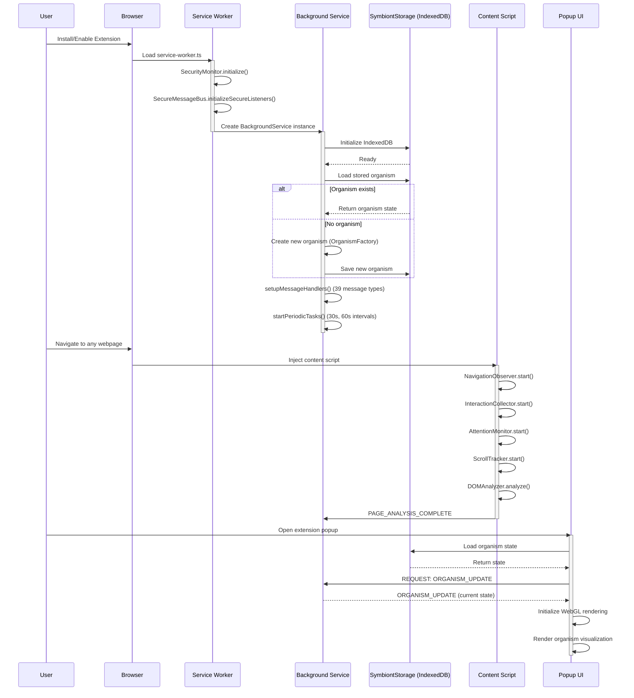
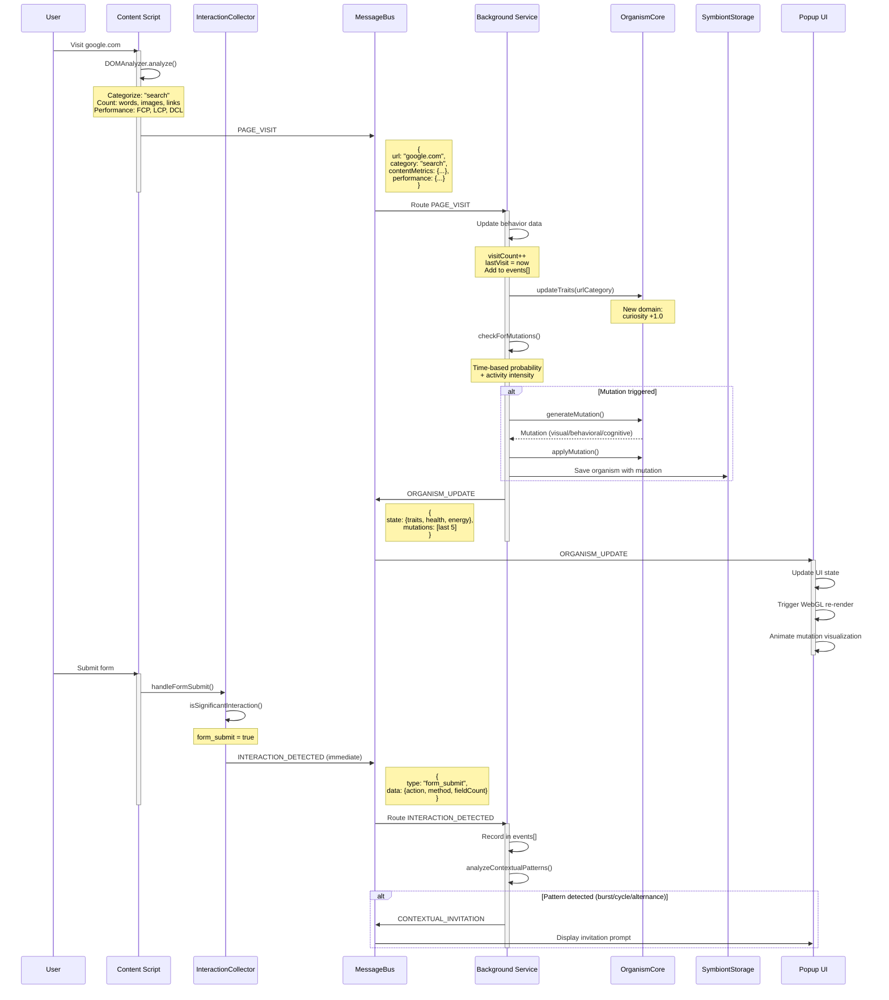
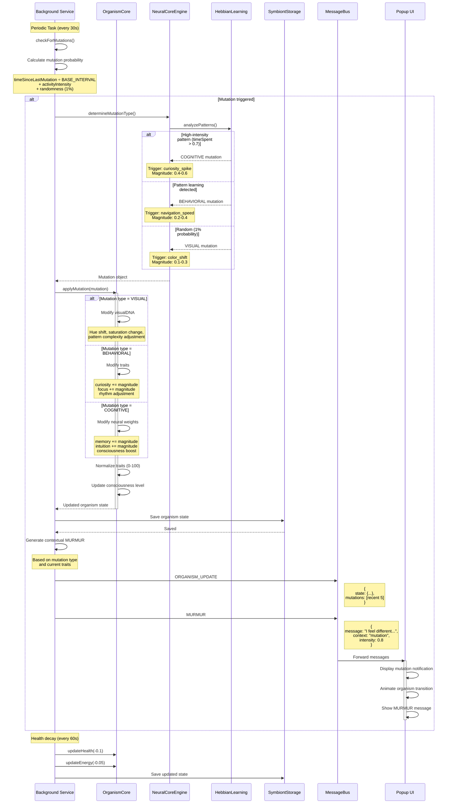
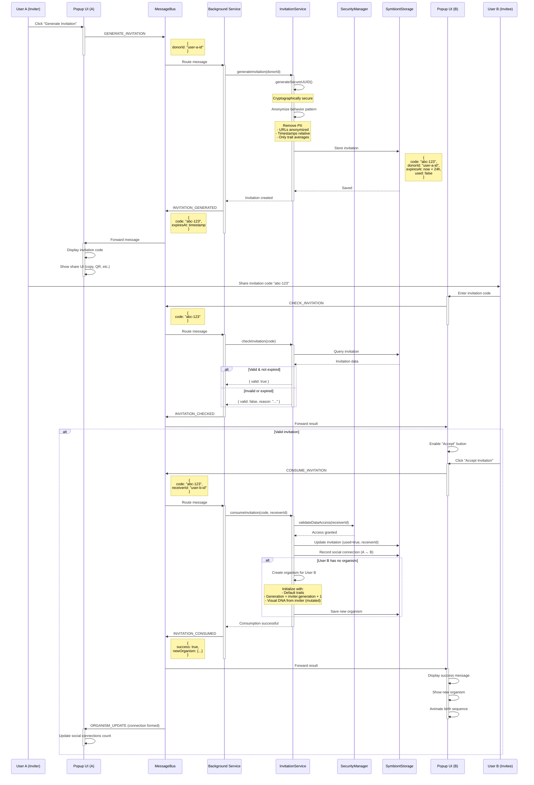
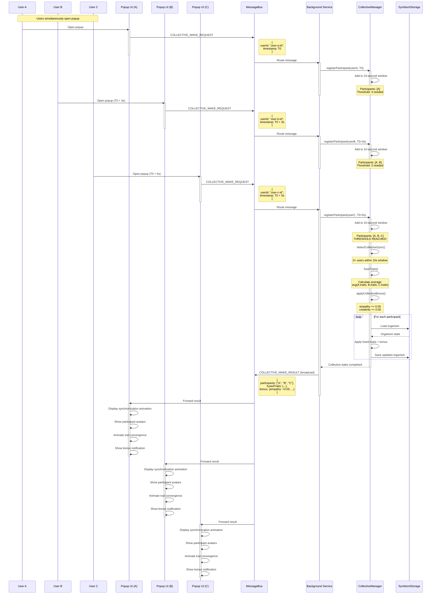
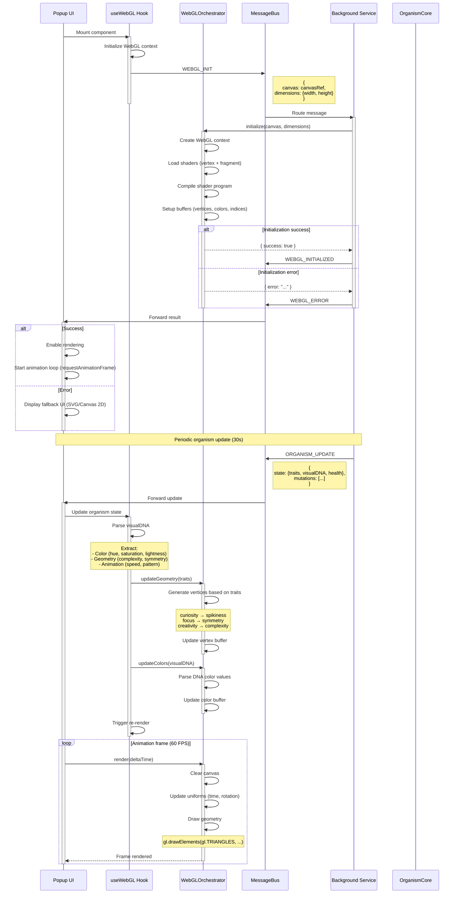

# SYMBIONT Extension Architecture - Sequence Diagrams

This document contains comprehensive sequence diagrams showing the message flows and component interactions in the SYMBIONT Chrome extension.

## Table of Contents
- [1. Extension Initialization](#1-extension-initialization)
- [2. Behavior Tracking Flow](#2-behavior-tracking-flow)
- [3. Organism Mutation Flow](#3-organism-mutation-flow)
- [4. Social Invitation Flow](#4-social-invitation-flow)
- [5. Collective Wake Flow](#5-collective-wake-flow)
- [6. WebGL Rendering Flow](#6-webgl-rendering-flow)

---

## 1. Extension Initialization

---

## 2. Behavior Tracking Flow

---

## 3. Organism Mutation Flow

---

## 4. Social Invitation Flow

---

## 5. Collective Wake Flow

---

## 6. WebGL Rendering Flow

---

## Architecture Patterns Summary

### Message-Driven Architecture
All components communicate exclusively through the MessageBus using 39 distinct message types, ensuring:
- **Loose coupling**: Components don't directly depend on each other
- **Async communication**: Non-blocking operations throughout
- **Type safety**: TypeScript enums for all message types

### Security Layers
1. **SecureMessageBus**: Validates, signs, and verifies all messages
   - Anti-replay protection (nonce tracking)
   - Message age verification (max 30s)
   - Schema validation per message type

2. **SecurityManager**: Encrypts sensitive data before storage
   - Access control validation
   - Data anonymization for sharing
   - GDPR-compliant handling

### Resilient Communication
- **Circuit Breaker**: Prevents cascade failures (5 failures → open circuit)
- **Persistent Queue**: Stores failed messages with retry strategies
- **Fallback Actions**: Graceful degradation per message type

### Event Sourcing
- All user behaviors recorded in events array
- Pattern detection on event history
- Mutation generation based on accumulated patterns

### Hebbian Learning
- Neural network strengthens connections between behaviors and outcomes
- High-intensity patterns trigger cognitive mutations
- Pattern learning drives behavioral mutations
- 1% random mutations for diversity

---

## Key Metrics

- **Message Types**: 39 distinct types across 6 categories
- **Components**: 3 main (Content, Background, Popup) + 15+ services
- **Storage**: IndexedDB (primary) + localStorage (fallback) + chrome.storage (flags)
- **Security**: 2 layers (message validation + encryption)
- **Resilience**: Circuit breaker + persistent queue + fallbacks
- **Performance**: 30s organism sync, 60s health decay, 100ms-1s behavior collection
- **Social**: P2P invitations, trait merging, collective synchronization

---

## File References

- MessageBus: `src/shared/messaging/MessageBus.ts:1`
- Content Script: `src/content/index.ts:1`
- Background Service: `src/background/index.ts:1`
- OrganismCore: `src/core/OrganismCore.ts:1`
- InvitationService: `src/background/InvitationService.ts:1`
- WebGL Orchestrator: `src/background/WebGLOrchestrator.ts:1`
- Popup Hooks: `src/popup/hooks/useMessaging.ts:1`
