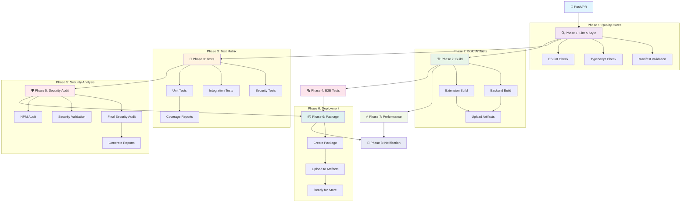

# Schéma Pipeline CI/CD SYMBIONT



## 📋 Description des Phases

### Phase 1: 🔍 Lint & Style Check
**Objectif:** Validation de la qualité du code
- **ESLint:** Analyse statique du code TypeScript
- **TypeScript:** Vérification des types et compilation
- **Manifest:** Validation du manifest Chrome Extension

**Critères de passage:**
- ✅ Aucune erreur ESLint critique
- ✅ Compilation TypeScript réussie
- ✅ Manifest V3 valide

---

### Phase 2: 🏗️ Build
**Objectif:** Construction des artefacts
- **Extension Build:** Webpack + optimisations
- **Backend Build:** Compilation API Express
- **Artifacts:** Upload pour phases suivantes

**Livrables:**
- 📦 `dist/` - Extension packagée
- 📦 `backend/dist/` - API compilée
- 📦 `manifest.json` - Manifest final

---

### Phase 3: 🧪 Tests
**Objectif:** Validation fonctionnelle en parallèle

**Matrix Strategy:**
```yaml
matrix:
  test-type: [unit, integration, security]
```

**Tests unitaires:**
- Core: OrganismCore, NeuralMesh
- Utils: SecureRandom, SecureLogger
- Services: Security, Storage

**Tests d'intégration:**
- Message Bus
- WebGL Bridge
- Storage Manager

**Tests sécurité:**
- Crypto compliance
- Data sanitization
- Environment validation

---

### Phase 4: 🎭 E2E Tests
**Objectif:** Tests end-to-end avec Playwright
- **Multi-browser:** Chrome, Firefox, Safari
- **Mobile:** Android Chrome, iOS Safari
- **Scénarios:** Installation, utilisation, performance

**Environnements:**
- Desktop: 1280x800
- Mobile: Pixel 5, iPhone 12
- Headless: CI/CD optimisé

---

### Phase 5: 🛡️ Security Audit
**Objectif:** Audit sécurité complet

**Vérifications:**
1. **NPM Audit:** Vulnérabilités dépendances
2. **Security Validation:** Script custom
3. **Final Audit:** Audit complet sécurité
4. **Report Generation:** JSON + HTML + PDF

**Seuils de validation:**
- 🎯 Score audit ≥ 80% (Grade B+)
- 🔒 0 vulnérabilité critique
- 📊 Coverage ≥ 85%

---

### Phase 6: 📦 Package & Deploy
**Objectif:** Création package final

**Conditions de déclenchement:**
- ✅ Toutes les phases précédentes réussies
- ✅ Branch `main` ou `release`

**Processus:**
1. **Download Artifacts:** Récupération build
2. **Create Package:** ZIP extension
3. **Upload Package:** Stockage long terme (365 jours)

**Format package:**
```
symbiont-extension-{commit-sha}.zip
├── dist/
├── manifest.json
└── README.md
```

---

### Phase 7: ⚡ Performance Monitoring
**Objectif:** Surveillance performance continue

**Benchmarks:**
- **SecureRandom vs Math.random():** Ratios performance
- **Memory Usage:** Consommation mémoire
- **FPS Simulation:** Performance WebGL
- **Load Time:** Temps de chargement extension

**Métriques surveillées:**
- 🚀 Temps de build < 5 minutes
- 💾 Package size < 50MB
- ⚡ FPS ratio > 0.9x
- 🧠 Memory delta < 100MB

---

### Phase 8: 📢 Notification & Status
**Objectif:** Communication résultats

**GitHub Actions Summary:**
```markdown
## 🚀 SYMBIONT CI/CD Pipeline Results

**Status:** ✅ SUCCESS
**Message:** Extension prête pour publication

### 📊 Étapes du Pipeline:
- 🔍 Lint: success
- 🏗️ Build: success  
- 🧪 Tests: success
- 🎭 E2E: success
- 🛡️ Security: success
- 📦 Package: success
- ⚡ Performance: success
```

## 🔄 Workflow Triggers

### Push Events
```yaml
on:
  push:
    branches: [ main, develop ]
```
- **main:** Pipeline complet + déploiement
- **develop:** Pipeline sans déploiement

### Pull Request
```yaml
on:
  pull_request:
    branches: [ main ]
```
- Pipeline complet sans package
- Validation avant merge

### Release
```yaml
on:
  release:
    types: [ published ]
```
- Pipeline optimisé production
- Package final marketplace

## 📊 Métriques & SLA

### Temps d'exécution cibles
- **Phase 1-3:** 5-10 minutes
- **Phase 4:** 10-15 minutes
- **Phase 5:** 5-10 minutes
- **Phase 6-8:** 2-5 minutes
- **Total:** 25-40 minutes

### Taux de succès cibles
- **Lint:** > 95%
- **Build:** > 98%
- **Tests:** > 90%
- **E2E:** > 85%
- **Security:** > 95%
- **Package:** > 99%

### Rétention des artefacts
- **Build artifacts:** 30 jours
- **Test reports:** 30 jours
- **Security reports:** 90 jours
- **Extension packages:** 365 jours
- **Performance reports:** 90 jours

## 🛠️ Configuration Environnement

### Variables d'environnement
```yaml
env:
  NODE_VERSION: '18'
  CACHE_DEPENDENCY_PATH: '**/package-lock.json'
```

### Secrets requis
- `NPM_TOKEN` - Publication packages (optionnel)
- `CHROME_STORE_TOKEN` - Publication store (optionnel)

## 🚀 Déploiement

### Déploiement automatique
- ✅ **Staging:** Branch `develop`
- ✅ **Production:** Branch `main` + tag
- ✅ **Chrome Store:** Release GitHub

### Rollback strategy
- Version précédente disponible dans artifacts
- Rollback via re-release GitHub
- Monitoring post-déploiement automatique