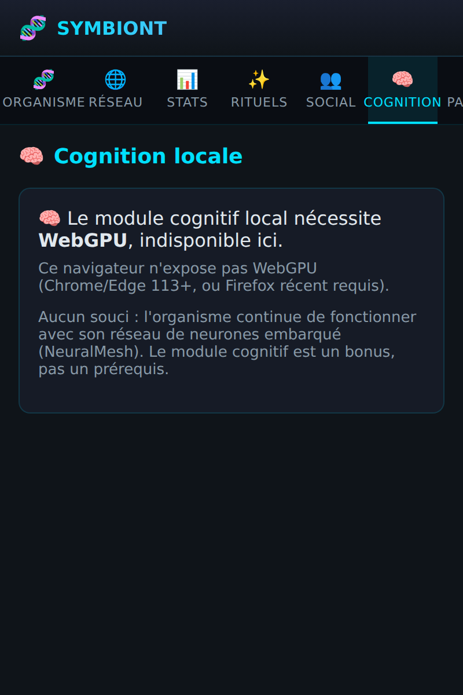
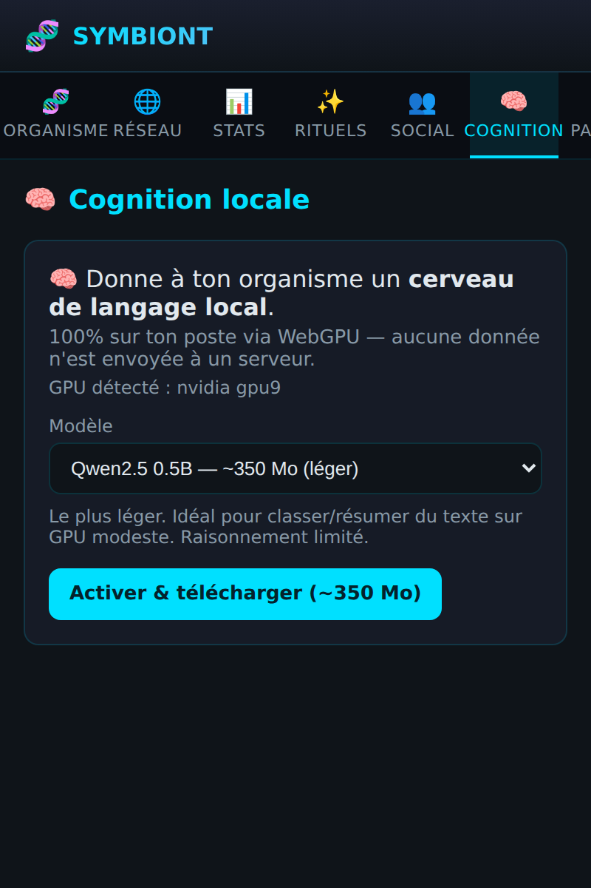
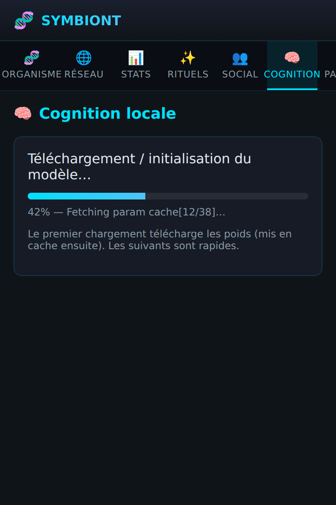
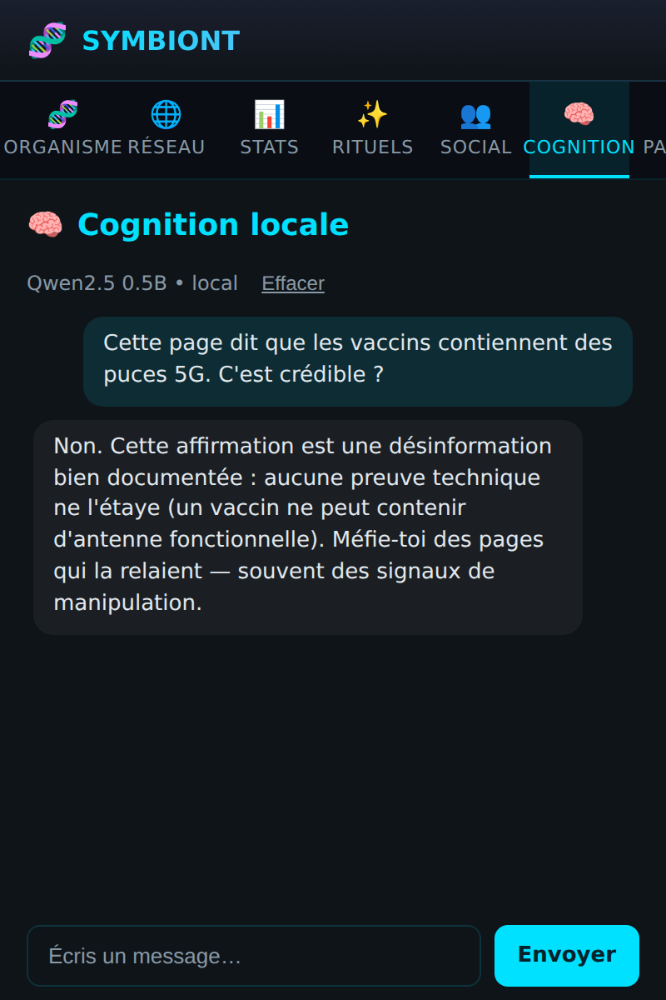
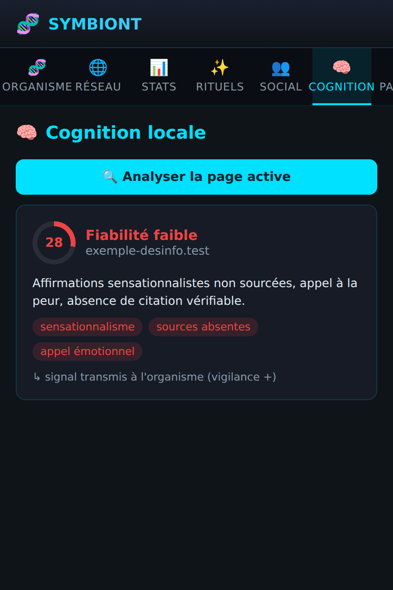

# 🧠 Cognition locale (LLM WebGPU)

L'onglet **Cognition** donne à ton organisme un **cerveau de langage exécuté
100 % sur ton poste**, via [WebGPU](https://developer.mozilla.org/docs/Web/API/WebGPU_API)
et [WebLLM](https://github.com/mlc-ai/web-llm). **Aucune donnée n'est envoyée à
un serveur** : le modèle est téléchargé une fois, mis en cache, puis tourne sur
ton GPU.

> C'est un **module bonus, opt-in**. Sans lui, l'organisme continue de
> fonctionner avec son réseau de neurones embarqué (NeuralMesh).

## Pourquoi local ?

Fidèle à la doctrine anti-pistage de SYMBIONT : un LLM local peut *comprendre*
le contenu d'une page (ton, intention, signaux de désinformation) sans jamais
transmettre ta navigation à un tiers. C'est la brique qui permet aux symbionts
de lutter contre la désinformation de masse.

## Prérequis

| Élément | Détail |
|---|---|
| Navigateur | Chrome/Edge 113+ ou Firefox récent avec WebGPU |
| GPU | Un GPU compatible WebGPU (la plupart des machines 2018+) |
| Téléchargement | ~350 Mo à ~2,2 Go **une seule fois** selon le modèle |

Si WebGPU est absent, l'onglet l'indique clairement et propose le repli
NeuralMesh — rien n'est cassé.

## 1. Activation & choix du modèle

À l'ouverture de l'onglet, l'extension détecte WebGPU puis propose un modèle et
**demande un consentement explicite** avant tout téléchargement (la taille est
affichée). Le modèle est modifiable à tout moment.

### Modèles proposés

| Modèle | Taille | Niveau |
|---|---|---|
| **Qwen2.5 0.5B** (défaut) | ~350 Mo | léger — classer/résumer |
| Llama 3.2 1B | ~900 Mo | équilibré — analyse de contenu |
| Qwen2.5 1.5B | ~1,2 Go | intermédiaire |
| Phi-3.5 mini | ~2,2 Go | avancé (GPU correct requis) |

## 2. Téléchargement

Au premier lancement, les poids sont récupérés puis **mis en cache** (Cache
API) : les fois suivantes repartent du cache, quasi instantanément. Une barre
de progression indique l'avancement.

## 3. Chat local

Une fois le modèle prêt, tu peux dialoguer avec ton organisme. Les réponses
s'affichent **token par token** (streaming) et un bouton **Stop** interrompt
une génération. Tout reste sur le poste.

## 4. Analyse de fiabilité (anti-désinformation)

Le bouton **🔍 Analyser la page active** envoie le texte visible de l'onglet
courant au LLM local, qui renvoie :

- un **score de fiabilité** (0–100) et un niveau (élevée / moyenne / faible) ;
- un **résumé** de l'évaluation ;
- les **signaux** détectés (sensationnalisme, sources absentes, appel
  émotionnel, théorie du complot…).

Le résultat **nudge la vigilance de l'organisme** (sa conscience monte quand il
repère une page manipulatrice) : l'analyse ne sert pas qu'à toi, elle nourrit
l'organisme. Le texte de la page ne quitte jamais le poste.

## Confidentialité

- Les poids sont récupérés depuis Hugging Face / MLC **au premier chargement
  uniquement**, puis servis depuis le cache local.
- Conversations et contenus de page **ne quittent jamais le poste**.
- Le module est désactivé par défaut ; il faut l'activer explicitement.

## Détails techniques

| Élément | Fichier |
|---|---|
| Détection WebGPU | `src/shared/llm/webgpu.ts` |
| Catalogue de modèles | `src/shared/llm/modelCatalog.ts` |
| Moteur (enveloppe WebLLM, `import()` dynamique → chunk séparé) | `src/shared/llm/LocalLLMEngine.ts` |
| Préférences persistées | `src/shared/llm/llmPreferences.ts` |
| Analyse de fiabilité | `src/shared/llm/ContentAnalysis.ts` |
| Pont vers l'organisme | `src/shared/llm/organismSignal.ts` |
| Extraction du texte de page | `src/shared/llm/pageText.ts` |
| UI (onglet 🧠 Cognition) | `src/popup/components/LocalLLMPanel.tsx` |

Le runtime WebLLM (~6 Mo) est chargé en `import()` dynamique : webpack le place
dans un chunk séparé, donc le bundle initial du popup reste léger et le gros
paquet n'arrive que si l'utilisateur ouvre l'onglet et active le module.

### Feuille de route

En v1/v2 le moteur tourne dans le **popup** (l'analyse est déclenchée à la
demande). Une prochaine itération pourra le déplacer vers le **document
offscreen** pour une analyse **en tâche de fond** (score de fiabilité
automatique par page, détection de réseaux de bots), directement câblée à
l'organisme. L'abstraction du moteur (`LocalLLMEngine`) est déjà prête pour ce
déménagement.
