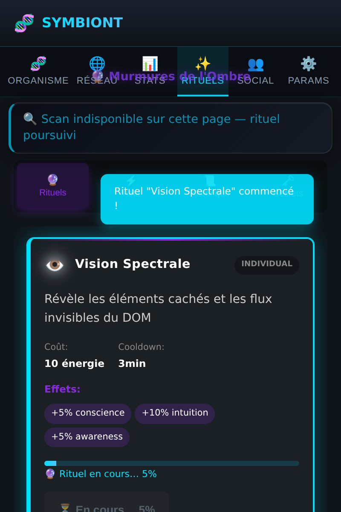
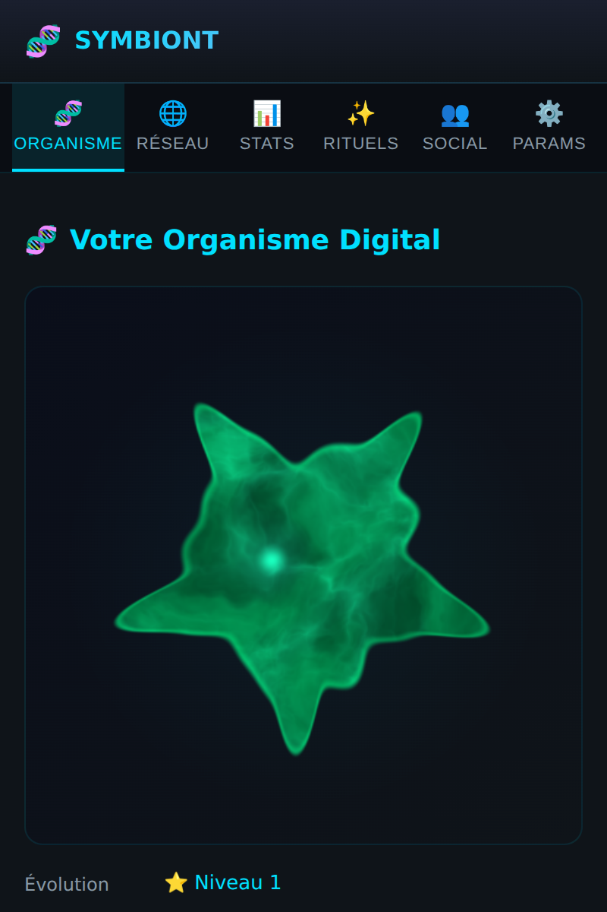
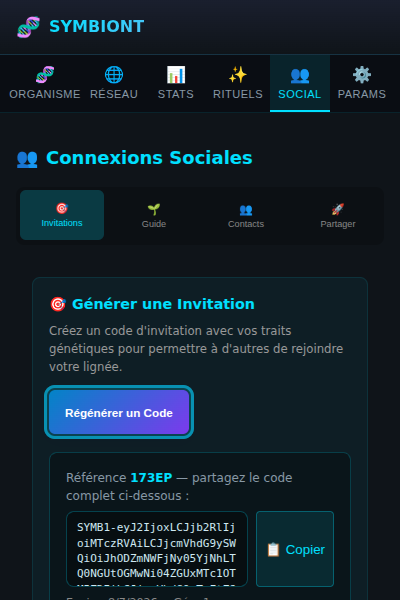
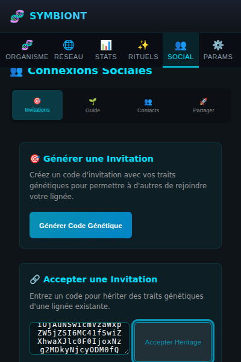
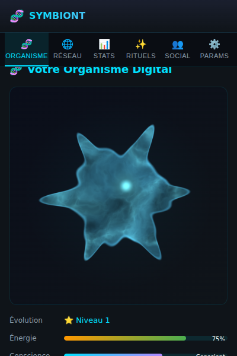

# Fonctionnalités vérifiées

Cette page réunit les **preuves en image** que les outils interactifs
fonctionnent réellement. Chaque flux a été exécuté sur le build courant, en
pilotant le popup de façon automatisée.

---

## ✨ Rituels — action réelle sur la créature

Lancer un rituel n'est pas décoratif : la carte passe en surbrillance avec une
**barre de progression** en direct, et l'organisme **réagit visuellement**.

*La carte « Vision Spectrale » est active (halo cyan, « 🔮 Rituel en cours… »).
Si le scan du DOM est indisponible (page protégée), le rituel se poursuit quand
même — le scan est un bonus, pas un prérequis bloquant.*

*Après le lancement, l'organisme passe en humeur « excité » : sa couleur vire au
vert et son énergie est consommée. Le retour visuel est immédiat.*

---

## 👥 Codes d'invitation — portables entre installations

Les codes sont **auto-porteurs** : la charge génétique est encodée dans le code
lui-même (`SYMB1-…`). Un code généré sur une machine fonctionne sur une autre
**sans serveur ni pair connecté**, par simple copier-coller.

*Installation A génère un code complet, affiché dans une boîte copiable
(bouton « Copier » avec confirmation).*

*Installation B — au stockage totalement isolé — colle le code et l'accepte.*

*L'organisme de B hérite des traits et réagit : humeur « heureux », conscience
+10 %.*

> **Vérification automatisée** : un token généré dans un contexte navigateur est
> accepté dans un second contexte au stockage isolé (succès, aucune erreur), et
> un code corrompu est rejeté proprement. Couvert par des tests unitaires
> (`InviteCode.test.ts`).

---

## Réglages qui prennent effet

Les réglages de la page **Paramètres** (réduire les animations, qualité du rendu)
sont persistés dans `chrome.storage.local` et appliqués en direct au moteur de
rendu. Couverts par `OrganismPreferences.test.ts`.

---

## Statut de vérification

| Fonctionnalité | Statut | Preuve |
|---|---|---|
| Rendu fractal de l'organisme (popup) | ✅ vérifié | rendu réel, tests moteur |
| Réglages Paramètres → rendu | ✅ vérifié | tests `OrganismPreferences` |
| Rituels + retour visuel | ✅ vérifié | flux headless + captures |
| Codes d'invitation cross-installation | ✅ vérifié | 2 contextes isolés + tests |
| Actions P2P live (partage/sync entre pairs) | 🧪 à valider | nécessite 2 instances réelles connectées |

*Les actions P2P en direct demandent deux navigateurs réellement connectés :
elles seront validées lors de la QA multi-profils (voir la checklist Firefox du
dépôt).*
