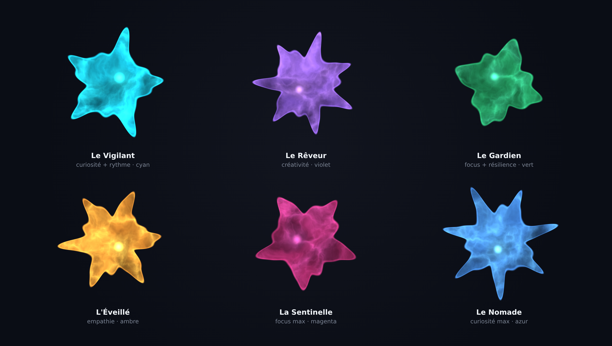

# 🧬 SYMBIONT — Wiki

**Une petite créature numérique qui vit dans votre navigateur et veille sur vous.**

SYMBIONT est une extension **Manifest V3** (Firefox / Chrome) qui installe un
organisme numérique vivant : il perçoit les signaux faibles du Web (traqueurs,
scripts cachés, coordination inauthentique), vous alerte par de discrets
« murmures », et se renforce au contact des autres organismes du réseau.

> 100 % local — aucune donnée personnelle transmise. Ce qui circule sur le
> réseau, ce ne sont jamais vos données, mais des signatures anonymes de menaces.

*Chaque organisme est **unique** : sa silhouette fractale, son protoplasme, son
noyau et sa couleur sont générés de façon déterministe à partir de son ADN et de
ses traits. Rendu WebGL réel du moteur `OrganismRenderer` (aucune retouche).*

---

## Navigation du wiki

Les 6 pages de l'extension, en détail avec captures :

- **[🧬 Organisme](Organisme)** — la créature, sa nutrition, ses contrôles.
- **[🌐 Réseau](Reseau)** — la maille P2P (graphe, pairs, messages, stats).
- **[📊 Stats](Stats)** — les métriques d'évolution.
- **[✨ Rituels](Rituels)** — les capacités actives (liste, actif, historique, secrets).
- **[👥 Social](Social)** — codes d'invitation, guide, contacts, partage.
- **[⚙️ Paramètres](Parametres)** — réglages de rendu.

Et aussi :

- **[✅ Fonctionnalités vérifiées](Fonctionnalites-verifiees)** — synthèse des tests.
- **[🌐 Navigateurs & installation](Navigateurs-et-installation)** — compatibilité et mise en route.

---

## En un coup d'œil

| | |
|---|---|
| **Type** | Extension navigateur, Manifest V3 |
| **Navigateurs** | 🦊 Firefox 140+ (recommandé), 🌐 Chrome/Chromium 120+, Edge/Brave/Opera |
| **Rendu** | WebGL fractal (WebGL2 → WebGL1), supersampling, alpha prémultiplié |
| **Vie privée** | Traitement 100 % local, aucune donnée personnelle transmise |
| **Distribution** | GitHub (Firefox : `.xpi` signé + mises à jour automatiques) |
| **Licence** | MIT |

---

## Les traits, moteur de l'unicité

Cinq axes indépendants (0–1) gouvernent l'apparence **et** le comportement :

| Trait | Effet visuel |
|---|---|
| 🧠 **Créativité** | Nombre de lobes de la membrane |
| 👁️ **Curiosité** | Longueur des tentacules |
| 🎯 **Focus** | Netteté des filaments internes |
| 💗 **Empathie** | Ondulation du contour |
| 🎵 **Rythme** | Cadence de pulsation |

Ces axes se combinent librement : un organisme peut être curieux **et**
concentré à la fois. Avec l'ADN comme graine, l'espace des personnalités est
pratiquement infini.
