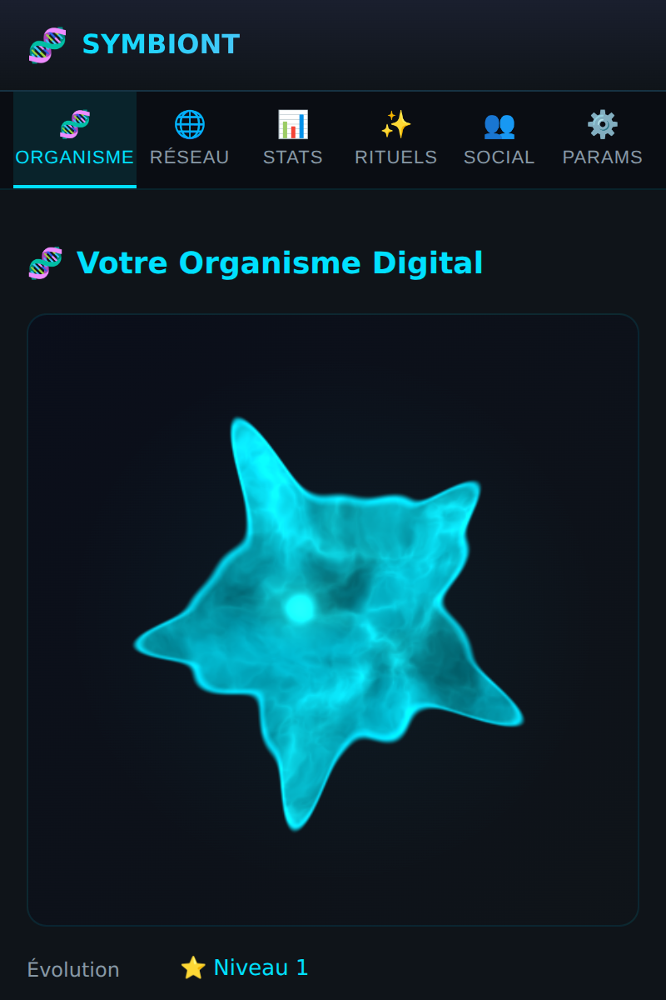
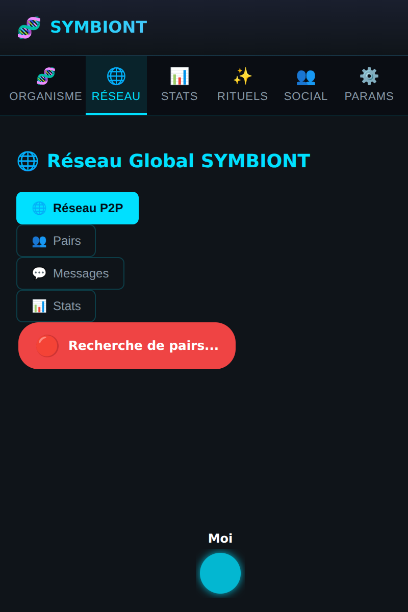
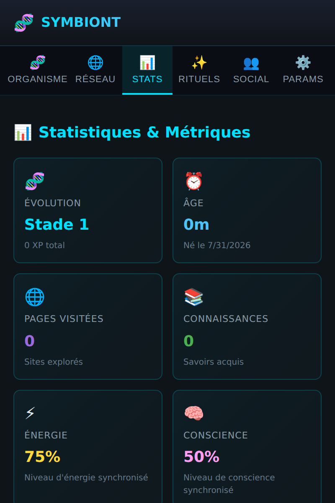
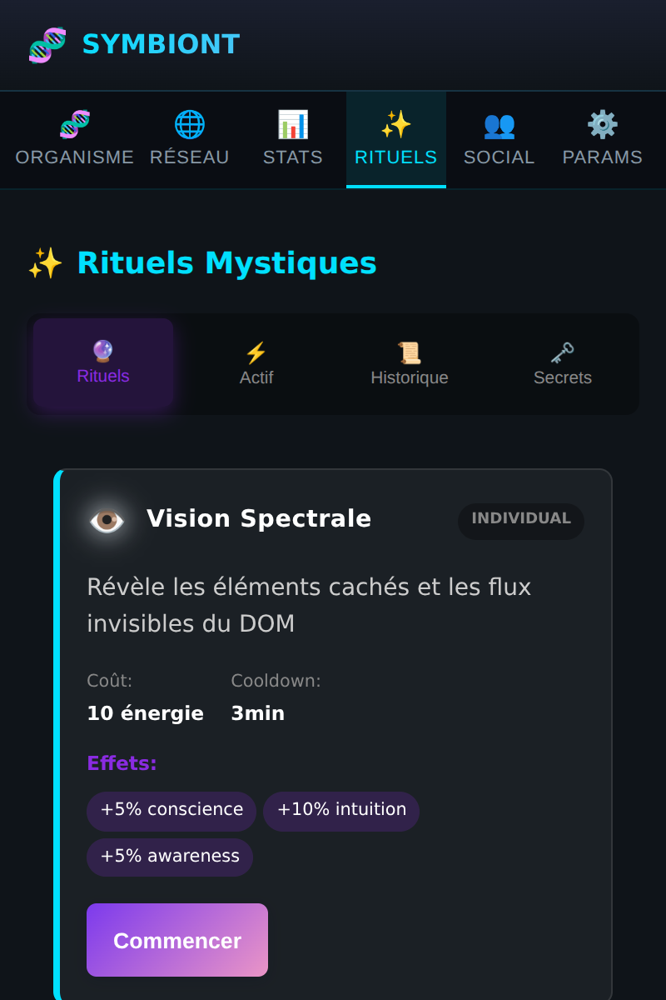
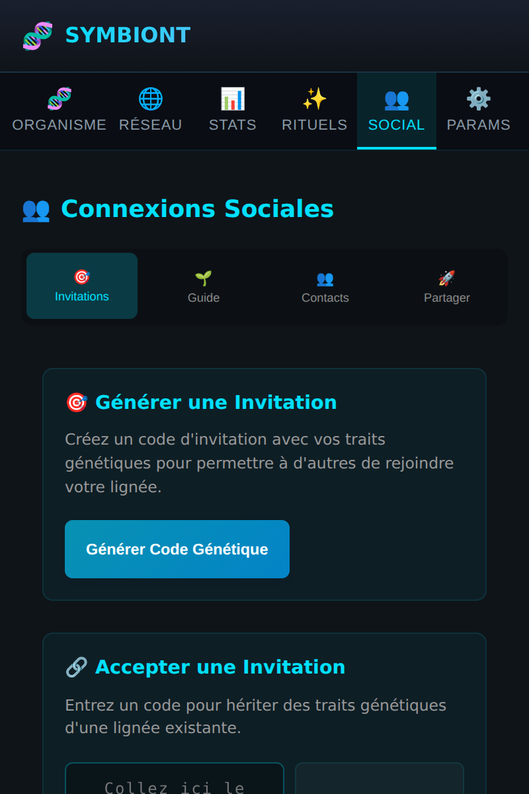
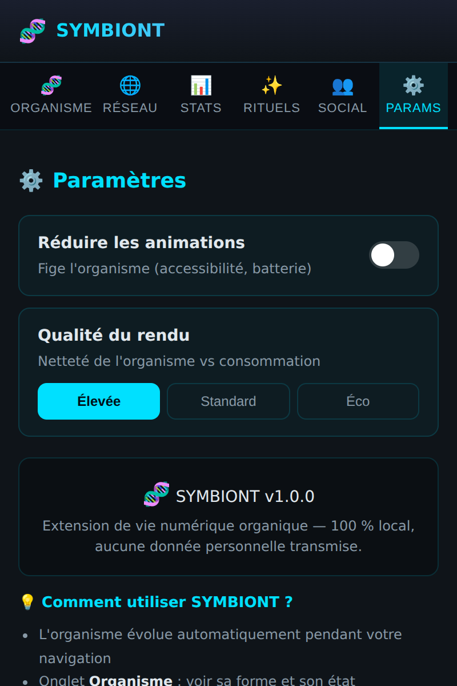

# Interface — les 6 pages

L'extension s'ouvre dans un **popup** (400 × 600) doté d'une barre de six onglets.
Voici chaque page et son rôle. Toutes les captures sont des **rendus réels** du
build actuel.

---

## 🧬 Organisme *(page d'accueil)*

Le cœur affectif de l'extension : votre organisme fractal vivant, rendu en WebGL
en temps réel. Sa forme, sa couleur et sa pulsation reflètent son ADN, ses traits,
son énergie et son humeur. En dessous : nutrition et contrôles.

---

## 🌐 Réseau

La maille P2P : graphe des organismes connectés autour du vôtre (« Moi » au
centre, en cyan). Sous-onglets **Réseau P2P / Pairs / Messages / Stats**. C'est
ici que se matérialise l'immunité collective — partage d'énergie, synchronisation,
messagerie entre pairs.

---

## 📊 Stats

Le tableau de bord chiffré : stade d'évolution, âge, pages visitées, connaissances
acquises, énergie, conscience. La vue analytique de la vie de l'organisme.

---

## ✨ Rituels

Les capacités actives (Vision Spectrale, Méditation Quantique, etc.) avec leur
coût en énergie, cooldown et effets. Lancer un rituel agit réellement sur la
créature — voir **[Fonctionnalités vérifiées](Fonctionnalites-verifiees)**.

---

## 👥 Social

Génétique sociale : générer un **code d'invitation** portant vos traits, ou en
accepter un pour hériter d'une lignée. Sous-onglets **Invitations / Guide /
Contacts / Partager**. Les codes sont auto-porteurs : ils fonctionnent d'une
installation à l'autre par simple copier-coller.

---

## ⚙️ Paramètres

Réglages **réels** câblés au rendu : *Réduire les animations* (accessibilité /
batterie) et *Qualité du rendu* (Élevée / Standard / Éco). Persistés et appliqués
immédiatement à l'organisme.
