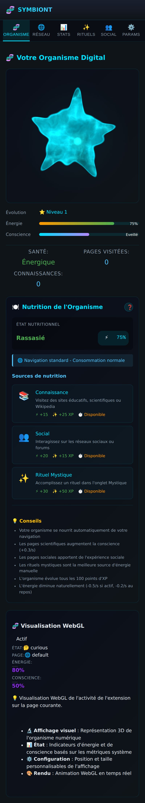

# 🧬 Page Organisme

La page d'accueil de l'extension : le cœur affectif où vit votre créature.

## Ce que contient la page

### Votre organisme (rendu WebGL)
En haut, l'organisme fractal rendu en temps réel par le moteur `OrganismRenderer` :
sa silhouette, sa couleur et sa pulsation reflètent son ADN, ses traits, son
énergie et son humeur. Deux barres résument son état : **Énergie** et
**Conscience** (ici « Éveillé »). Un encart affiche Santé, Pages visitées et
Connaissances.

### Nutrition de l'Organisme
La créature se nourrit de votre navigation. Le panneau **Nutrition** montre :
- l'**état nutritionnel** (ici « Rassasié », 75 %) et le mode de consommation,
- les **sources de nutrition** avec leurs gains — Connaissance (+15 énergie /
  +25 XP), Social (+20 / +15 XP), Rituel Mystique (+30 / +50 XP),
- des **conseils** expliquant comment l'organisme évolue (pages scientifiques →
  conscience, pages sociales → expérience sociale, rituels → énergie, etc.).

### Visualisation WebGL (contrôles)
En bas, l'état de la visualisation : activation, humeur courante, type de page,
niveaux d'énergie/conscience, et l'explication du rendu 3D temps réel.

## Réglages associés
La netteté et l'animation de l'organisme se règlent dans
**[Paramètres](Parametres)** (qualité du rendu, réduction des animations).
