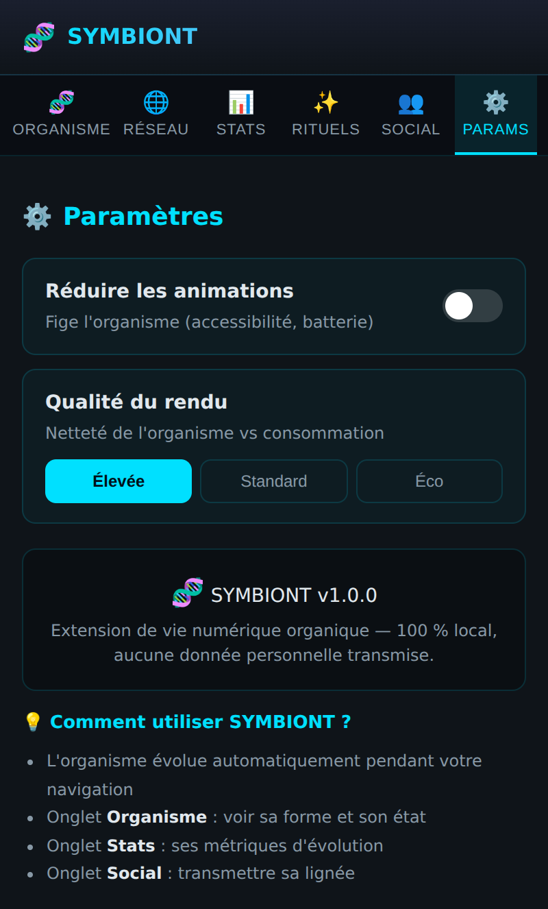
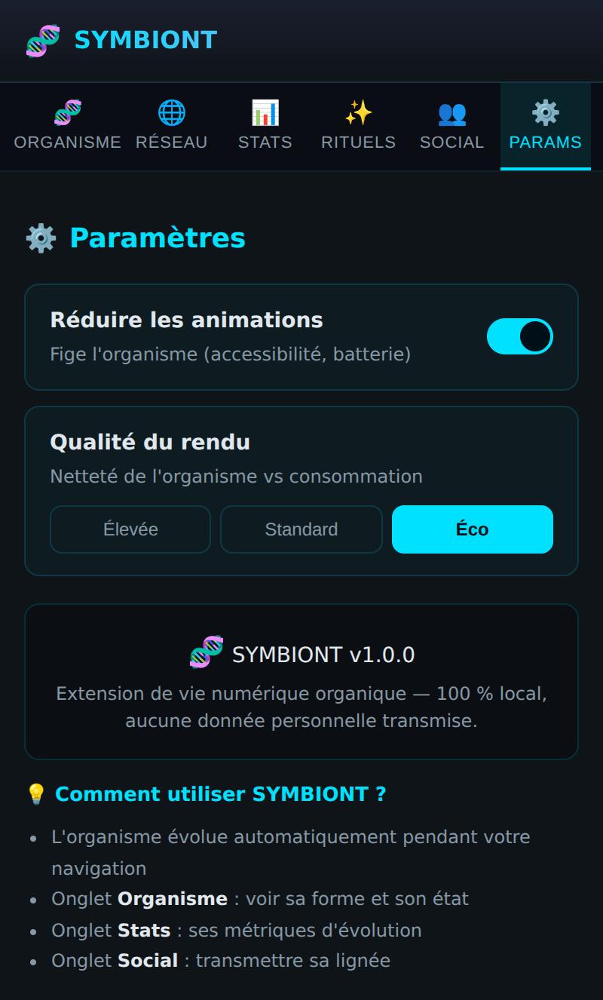

# ⚙️ Page Paramètres

Des réglages **réels**, persistés et appliqués immédiatement au rendu de
l'organisme.

## État par défaut

- **Réduire les animations** — fige l'organisme (accessibilité, batterie).
  Par défaut, suit le réglage système `prefers-reduced-motion`.
- **Qualité du rendu** — Élevée / Standard / Éco, qui pilote le supersampling
  (2× / 1.5× / 1×). « Élevée » sélectionné par défaut.

## Après modification

Ici « Réduire les animations » est activé (interrupteur cyan) et la qualité est
passée en **Éco**. Ces choix sont **persistés** dans `chrome.storage.local` et
**appliqués en direct** à l'organisme (l'animation se fige, le supersampling
baisse) — sans rechargement.

## Vérification
Le service de préférences est couvert par `OrganismPreferences.test.ts` (valeurs
par défaut, persistance, rechargement, notification des abonnés, mapping
qualité → supersampling).

> Aucun réglage « décoratif » : seuls les contrôles réellement câblés au moteur
> sont exposés.
