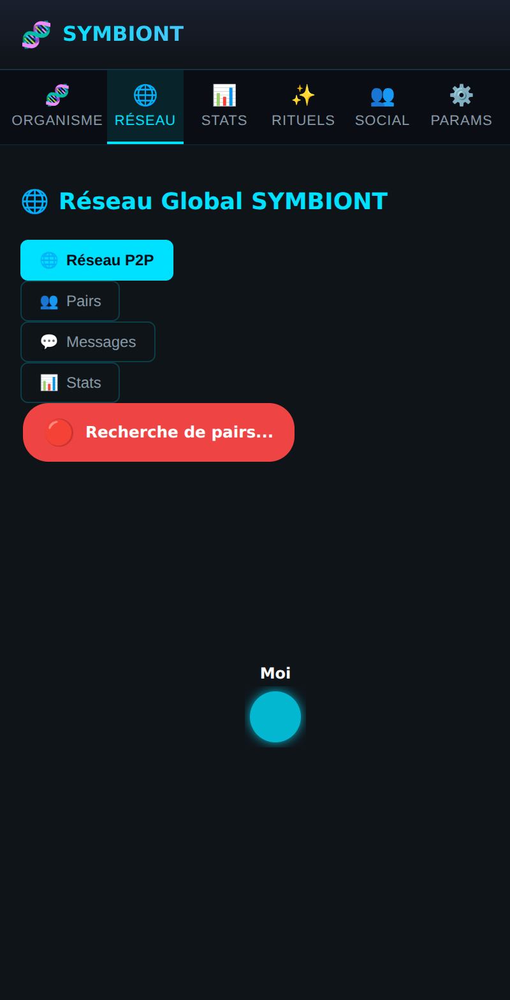
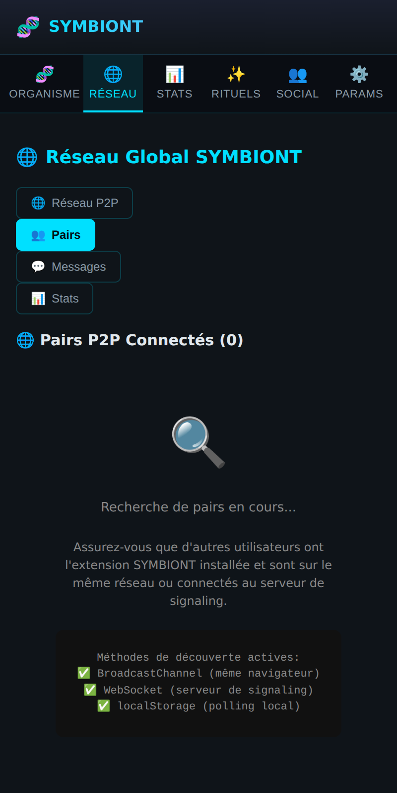
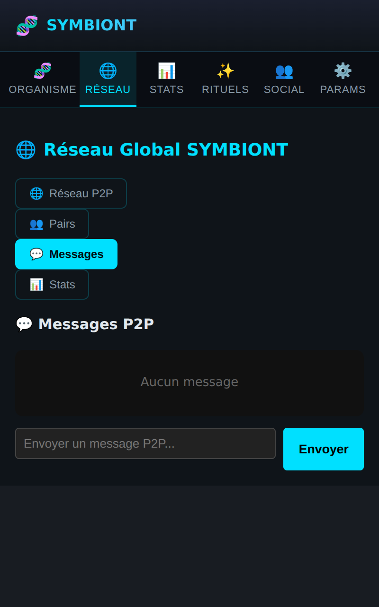
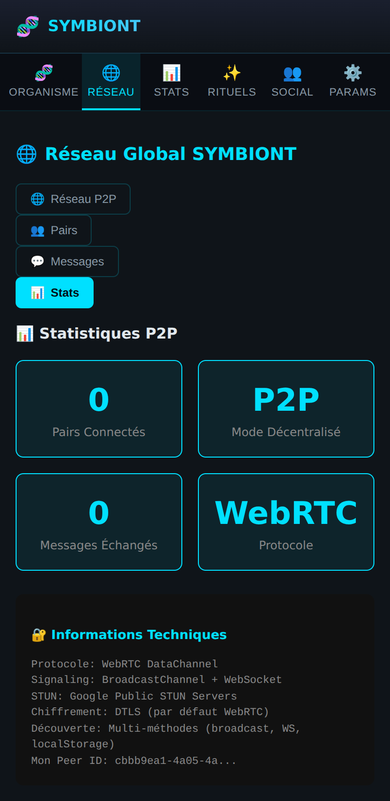

# 🌐 Page Réseau

La maille P2P : votre organisme au centre d'un réseau d'autres organismes.
Quatre sous-onglets.

## Réseau P2P (graphe)

Graphe de force avec votre nœud **« Moi »** au centre (en cyan, avec halo), les
pairs autour, et un badge de statut de connexion. Le zoom à la molette est
supporté. Les nœuds connectés pulsent ; les liens animent le flux de données.

## Pairs

Liste des pairs P2P connectés, avec pour chacun ses métriques (génération,
conscience, énergie) et les actions disponibles.

## Messages

Messagerie P2P : historique des échanges et champ d'envoi. Les messages
transitent directement entre extensions via WebRTC DataChannels.

## Stats (réseau)

Statistiques du réseau : nombre de pairs connectés, volume de données échangées,
santé de la maille.

> **Note technique** : les DataChannels WebRTC fonctionnent pleinement dans la
> page d'événements Firefox. Sur Chrome (service worker MV3), la découverte
> fonctionne mais les connexions directes sont limitées — voir l'audit de portage
> dans le dépôt. La validation P2P bout-à-bout demande deux instances réellement
> connectées (QA multi-profils).
