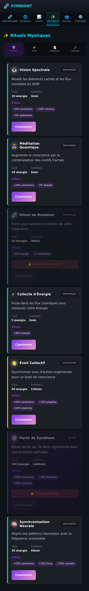
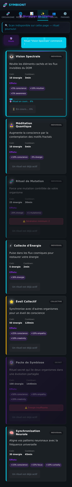
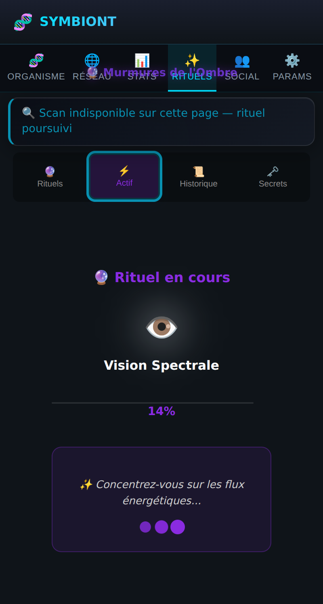
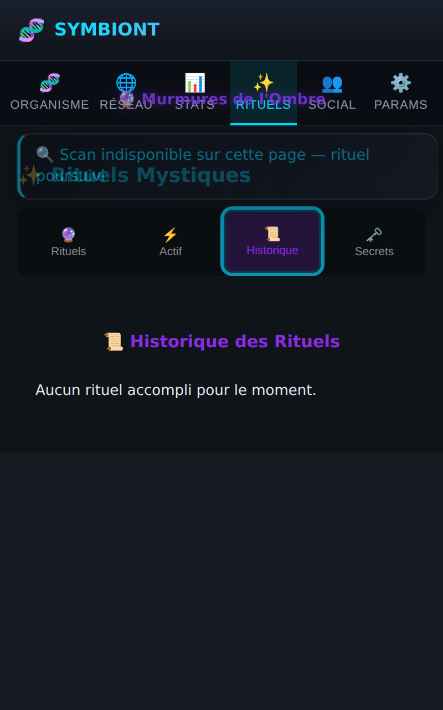
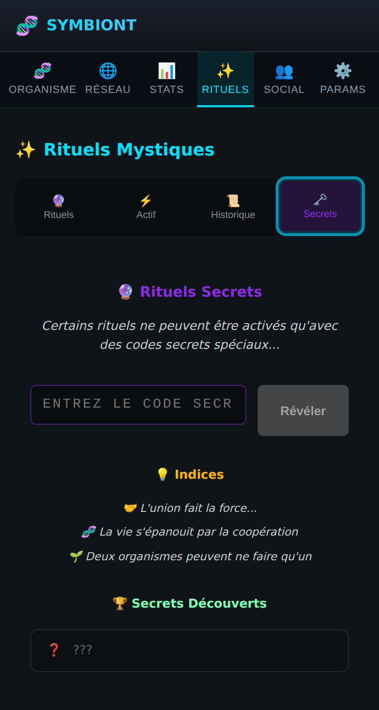

# ✨ Page Rituels

Les capacités actives de l'organisme. Quatre sous-onglets. **Les rituels agissent
réellement sur la créature** — voir la preuve en bas de page.

## Liste des rituels

Chaque rituel affiche son icône, sa description, son **coût en énergie**, son
**cooldown** et ses **effets** (conscience, intuition, mutations…). Types :
individuel, collectif, secret.

Exemples : **Vision Spectrale** (révèle les éléments cachés du DOM),
**Méditation Quantique** (+conscience), **Rituel de Mutation**, **Collecte
d'Énergie**.

## Rituel en cours (retour visuel)

Au lancement, la carte du rituel passe en **surbrillance cyan** avec une **barre
de progression en direct** (« 🔮 Rituel en cours… X% »), le bouton devient
« ⏳ En cours… X% », et les autres rituels se désactivent (pas de double-lancement).

Si le scan du DOM est indisponible (page protégée, aucun onglet actif), le rituel
**se poursuit quand même** et applique ses effets — le scan est un bonus, pas un
prérequis bloquant.

## Actif

Suivi détaillé du rituel en cours : icône, nom, barre de progression et
pourcentage, avec une animation d'ondes énergétiques.

## Historique

Journal des rituels accomplis (les 50 derniers), avec leurs effets.

## Secrets

Certains rituels ne s'activent qu'avec un **code secret**. La page propose un
champ de saisie, des **indices** (« L'union fait la force… ») et la liste des
secrets déjà découverts.

## ✅ Preuve : l'organisme réagit

Après le lancement, l'organisme passe en humeur « excité » (sa couleur vire au
vert) et son énergie est consommée. Le retour visuel est immédiat, sur la page
Organisme.
