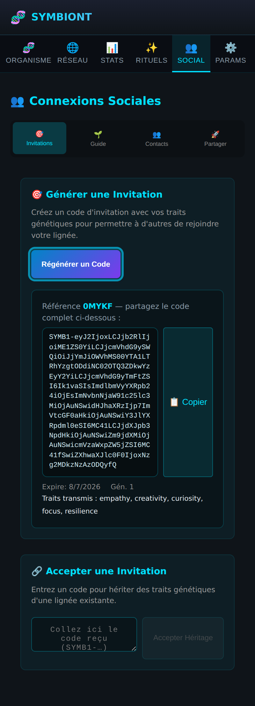
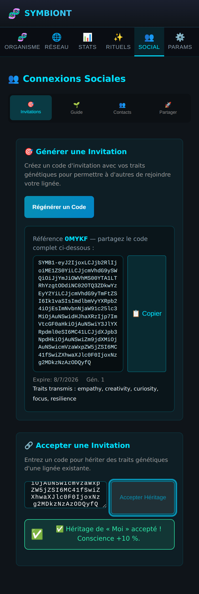
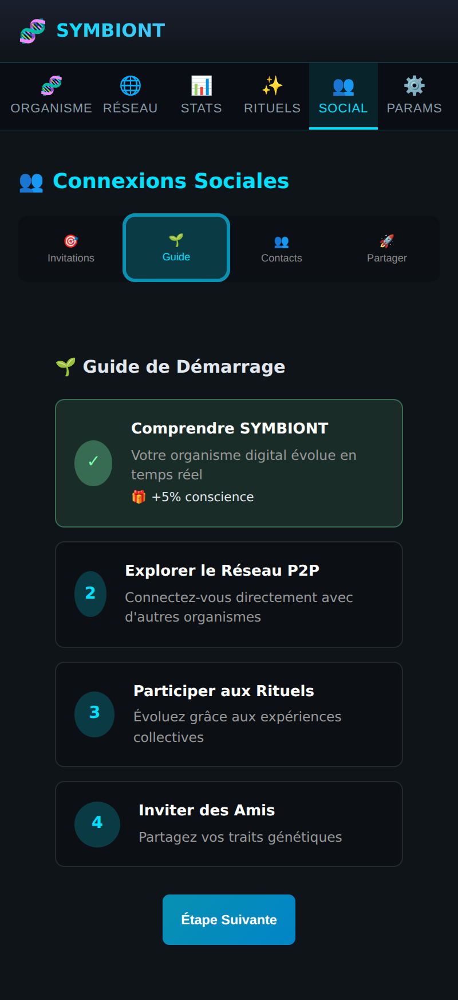
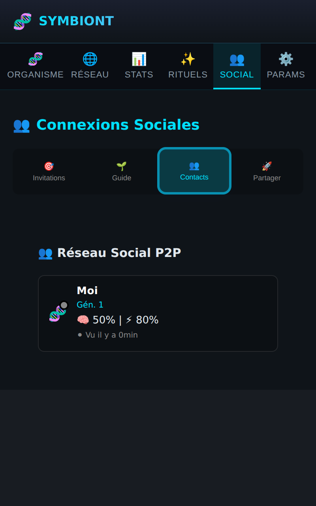
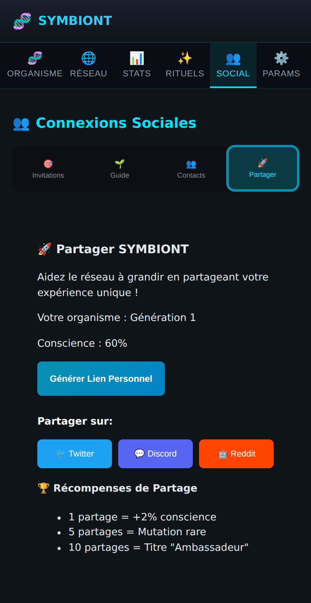

# 👥 Page Social

Génétique sociale : transmettre et hériter de lignées. Quatre sous-onglets.

## Invitations — générer un code

Le bouton **Générer Code Génétique** produit un code **auto-porteur** : la charge
génétique (traits, génération, conscience, expiration) est encodée **dans le code
lui-même** (`SYMB1-…`). Il s'affiche dans une boîte copiable (bouton **Copier**
avec confirmation « ✅ Copié »). Un code court lisible (ex. « 173EP ») sert de
référence.

**Pourquoi c'est important** : le code fonctionne d'une installation à l'autre
par simple copier-coller, **sans serveur ni pair connecté**. C'est ce qui rend
l'invitation réellement utilisable entre deux personnes.

## Invitations — accepter un code

On colle le code reçu dans le champ et on clique **Accepter Héritage**. Le code
est décodé et validé (format + expiration). En cas de succès, un message inline
vert confirme l'héritage ; en cas d'erreur (code invalide/expiré), un message
rouge l'explique — plus d'`alert()` intempestif.

L'organisme **hérite des traits** (moyenne pondérée) et **réagit visuellement** :

*Humeur « heureux », conscience +10 %.*

## Guide

Parcours d'accueil pas à pas (comprendre SYMBIONT, explorer le réseau, participer
aux rituels, inviter des amis), avec des récompenses à chaque étape.

## Contacts

Liste des lignées connectées : organismes rencontrés via invitations ou réseau
P2P, avec leur statut et leurs métriques.

## Partager

Génération de liens de partage pour diffuser sa lignée au-delà de l'extension.

## ✅ Vérification cross-installation

Un token généré dans un contexte navigateur a été **accepté avec succès dans un
second contexte au stockage totalement isolé** (aucune donnée partagée), et un
code corrompu est rejeté proprement. Couvert par des tests unitaires
(`InviteCode.test.ts`, 7 cas).

> **Limite honnête** : le plafond « nombre d'utilisations » ne peut pas être
> appliqué globalement hors-ligne (chaque destinataire n'a que le code, sans
> autorité centrale). L'**expiration**, elle, est encodée dans le code et
> vérifiée. Un vrai quota d'usages nécessiterait un backend.
