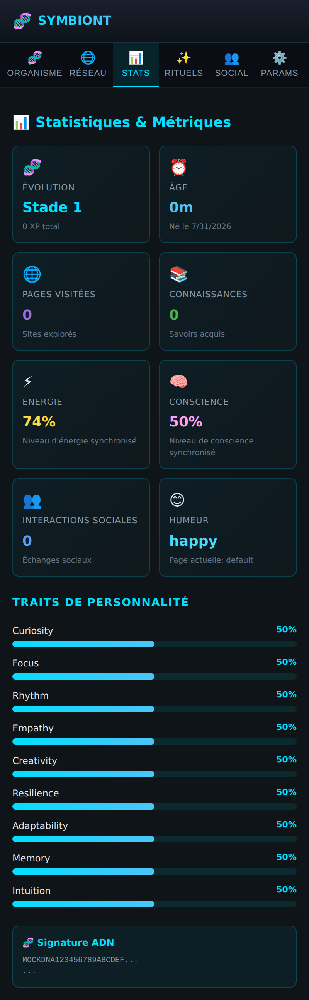

# 📊 Page Stats

Le tableau de bord chiffré de la vie de l'organisme.

## Métriques affichées

| Carte | Signification |
|---|---|
| 🧬 **Évolution** | Stade d'évolution (1–10) et XP total accumulé |
| ⏰ **Âge** | Durée de vie de l'organisme et date de naissance |
| 🌐 **Pages visitées** | Nombre de sites explorés |
| 📚 **Connaissances** | Savoirs acquis sur les pages éducatives |
| ⚡ **Énergie** | Niveau d'énergie synchronisé (0–100 %) |
| 🧠 **Conscience** | Niveau de conscience synchronisé (0–100 %) |

Ces métriques sont alimentées en continu par l'activité de navigation et par les
actions de l'utilisateur (rituels, héritages sociaux). Elles se reflètent
directement sur l'apparence de l'organisme (énergie → éclat du noyau, conscience
→ complexité de la membrane).
