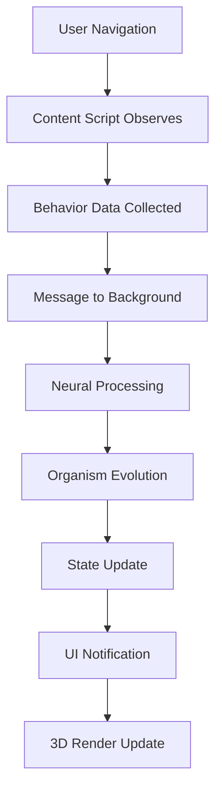

# Architecture SYMBIONT

Vue d'ensemble complète du système SYMBIONT : design, composants, flux de données et évolution architecturale.

## 🏗️ Vue d'Ensemble

SYMBIONT utilise une architecture modulaire et résiliente basée sur :
- **Service Worker** (Background Script) pour le traitement IA
- **Content Scripts** pour l'observation comportementale
- **Popup React** pour l'interface utilisateur
- **Modules Core** pour la logique métier
- **Bus de Messages** pour la communication inter-composants

### Diagramme d'Architecture Globale

```
┌─────────────────┐    ┌──────────────────┐    ┌─────────────────┐
│   Content       │    │    Background    │    │     Popup       │
│   Scripts       │◄──►│   Service Worker │◄──►│   React UI      │
└─────────────────┘    └──────────────────┘    └─────────────────┘
         │                        │                       │
         ▼                        ▼                       ▼
┌─────────────────┐    ┌──────────────────┐    ┌─────────────────┐
│ Behavior        │    │  Core Modules    │    │ UI Components   │
│ Collection      │    │  - Organism Core │    │ - Dashboard     │
│ - DOM Observer  │    │  - Neural Mesh   │    │ - 3D Viewer     │
│ - Event Capture │    │  - Storage Mgr   │    │ - Settings      │
│ - Pattern Detect│    │  - Security Mgr  │    │ - Social Panel  │
└─────────────────┘    └──────────────────┘    └─────────────────┘
```

## 🧩 Composants Principaux

### 1. Content Scripts (`src/content/`)

**Responsabilités:**
- Collection de données comportementales
- Observation des interactions DOM
- Injection d'éléments d'interface contextuels
- Communication avec Background Script

**Modules clés:**
```
content/
├── index.ts              # Point d'entrée principal
├── collectors/           # Collecteurs de données
│   ├── BehaviorCollector.ts
│   ├── DOMObserver.ts
│   └── InteractionTracker.ts
├── observers/           # Observateurs spécialisés
│   ├── ScrollObserver.ts
│   ├── ClickObserver.ts
│   └── NavigationObserver.ts
└── injectors/          # Injection d'UI contextuelle
    ├── TooltipInjector.ts
    └── OverlayManager.ts
```

### 2. Background Service Worker (`src/background/`)

**Responsabilités:**
- Traitement IA et apprentissage
- Gestion de l'état de l'organisme
- Communication réseau P2P
- Orchestration des modules core

**Architecture interne:**
```
background/
├── index.ts                    # Service Worker principal
├── ServiceWorkerManager.ts     # Gestion lifecycle SW
├── SecurityManager.ts          # Sécurité et chiffrement
├── WebGLOrchestrator.ts       # Coordination rendu 3D
├── services/                   # Services métier
│   ├── OrganismService.ts
│   ├── NeuralService.ts
│   ├── SocialService.ts
│   └── StorageService.ts
└── workers/                   # Web Workers
    ├── NeuralWorker.ts
    └── CryptoWorker.ts
```

### 3. Popup Interface (`src/popup/`)

**Responsabilités:**
- Interface utilisateur principale
- Visualisation 3D de l'organisme
- Configuration et paramètres
- Monitoring en temps réel

**Structure React:**
```
popup/
├── index.tsx               # Point d'entrée React
├── App.tsx                 # Composant racine
├── components/             # Composants UI
│   ├── Dashboard.tsx
│   ├── OrganismViewer.tsx
│   ├── Settings.tsx
│   ├── SocialPanel.tsx
│   └── MetricsPanel.tsx
├── hooks/                  # Hooks React personnalisés
│   ├── useOrganism.ts
│   ├── useMessageBus.ts
│   └── useTheme.ts
└── services/              # Services popup
    ├── PopupService.ts
    └── UIService.ts
```

### 4. Core Modules (`src/core/`)

**Responsabilités:**
- Logique métier centrale
- Gestion de l'état de l'organisme
- Algorithmes d'apprentissage
- Persistance des données

**Modules principaux:**

#### OrganismCore (`src/core/OrganismCore.ts`)
```typescript
class OrganismCore {
  // Traits de l'organisme
  private traits: OrganismTraits;
  
  // Historique d'évolution
  private evolutionHistory: EvolutionEvent[];
  
  // Méthodes principales
  public evolve(behaviorData: BehaviorData[]): Evolution;
  public mutate(trigger: MutationTrigger): Mutation;
  public learn(experience: Experience): void;
}
```

#### NeuralMesh (`src/core/NeuralMesh.ts`)
```typescript
class NeuralMesh {
  // Réseau de neurones adaptatif
  private network: NeuralNetwork;
  
  // Apprentissage hebbien
  public hebbianLearning(input: number[], output: number[]): void;
  
  // Prédiction comportementale
  public predict(context: Context): Prediction;
}
```

#### Storage Manager (`src/core/storage/`)
```typescript
class HybridStorageManager {
  // Stockage multi-niveaux
  private memoryCache: MemoryStorage;
  private chromeStorage: ChromeStorage;
  private indexedDB: IndexedDBStorage;
  
  // Fallback automatique
  public store(key: string, data: any): Promise<void>;
  public retrieve(key: string): Promise<any>;
}
```

## 🔄 Flux de Données

### 1. Cycle de Vie Principal



### 2. Pipeline de Messages

```
[Content Script] 
    ↓ (Behavior Data)
[Resilient Message Bus]
    ↓ (Validated Messages)
[Background Service]
    ↓ (Processing)
[Core Modules]
    ↓ (Results)
[Storage Manager] ← → [UI Components]
```

### 3. Flux de Données Critiques

```
┌──────────────────┐    Messages     ┌─────────────────────┐
│   Content        │ ────────────► │  Resilient Message  │
│   Script         │               │  Bus                │
└──────────────────┘               └─────────────────────┘
                                              │
                                              ▼
┌──────────────────┐    Dispatch    ┌─────────────────────┐
│   Core           │ ◄────────────  │  Background         │
│   Modules        │               │  Service Worker     │
└──────────────────┘               └─────────────────────┘
         │                                    │
         ▼                                    ▼
┌──────────────────┐               ┌─────────────────────┐
│   Hybrid         │               │  Health & Security  │
│   Storage        │               │  Monitoring         │
└──────────────────┘               └─────────────────────┘
```

## 🏛️ Évolution Architecturale

### Phase 1 : Résilience (2024) ✅

**Objectif:** Stabilité et fiabilité de base

**Modules implémentés:**
- **Persistent Service Worker** : Heartbeat, auto-réveil, maintenance préventive
- **Resilient Message Bus** : Communication tolérante aux pannes, retry automatique
- **Hybrid Storage Manager** : Stockage multi-niveaux avec fallback
- **Basic Health Monitor** : Surveillance CPU/mémoire, détection d'anomalies

**Architecture Phase 1:**
```
Content Script ◄─► [Resilient Message Bus] ◄─► Background Service
                              │
                              ▼
                   [Hybrid Storage Manager]
                              ▲
                              │
                     [Health Monitor]
```

### Phase 2 : Intelligence Adaptive (2024) ✅

**Objectif:** Adaptation contextuelle et monitoring prédictif

**Modules ajoutés:**
- **ContextAwareOrganism** : Adaptation dynamique aux contextes
- **PredictiveHealthMonitor** : Anticipation des problèmes
- **BehavioralPredictor** : Prédiction d'actions utilisateur
- **PerformanceAnalytics** : Métriques en temps réel

**Améliorations Phase 2:**
```
┌─────────────────┐    Context     ┌──────────────────┐
│ Context Aware   │ ◄─────────── │ Environment      │
│ Organism        │              │ Detector         │
└─────────────────┘              └──────────────────┘
         │                                 │
         ▼                                 ▼
┌─────────────────┐               ┌──────────────────┐
│ Behavioral      │               │ Predictive       │
│ Predictor       │               │ Health Monitor   │
└─────────────────┘               └──────────────────┘
```

### Phase 3 : Écosystème Social (2024) ✅

**Objectif:** Intelligence collective et résilience communautaire

**Modules sociaux:**
- **DistributedOrganismNetwork** : Réseau P2P sécurisé
- **CollectiveIntelligence** : Consensus et décisions émergentes
- **SocialResilience** : Backup communautaire et récupération
- **MysticalEvents** : Événements distribués et rituels

**Architecture Sociale:**
```
┌─────────────────┐    P2P Net    ┌──────────────────┐
│ Organism A      │ ◄──────────► │ Organism B       │
└─────────────────┘              └──────────────────┘
         │                                 │
         ▼                                 ▼
┌─────────────────┐               ┌──────────────────┐
│ Collective      │ ◄──────────► │ Mystical Events  │
│ Intelligence    │              │ System           │
└─────────────────┘              └──────────────────┘
         │                                 │
         ▼                                 ▼
┌──────────────────────────────────────────────────┐
│           Community Backup Network                │
└──────────────────────────────────────────────────┘
```

### Phase 4 : Optimisation Ultime (2024-2025) 🚧

**Objectif:** Performance maximale et intégration complète

**Modules prévus:**
- **Advanced ML Engine** : Apprentissage profond distribué
- **GPU Acceleration** : Calculs massivement parallèles
- **Quantum-Inspired Computing** : Algorithmes quantiques simulés
- **Full Backend Integration** : API REST complète

## 🛡️ Sécurité et Intégrité

### Architecture de Sécurité

```
┌─────────────────┐              ┌──────────────────┐
│ Data Input      │    Validate  │ Security         │
│ Validation      │ ────────────►│ Manager          │
└─────────────────┘              └──────────────────┘
         │                                 │
         ▼                                 ▼
┌─────────────────┐              ┌──────────────────┐
│ Secure Random   │              │ Encrypted        │
│ Generation      │              │ Storage          │
└─────────────────┘              └──────────────────┘
         │                                 │
         ▼                                 ▼
┌──────────────────────────────────────────────────┐
│            Secure Logging System                  │
│    (GDPR Compliant + Data Sanitization)         │
└──────────────────────────────────────────────────┘
```

### Points de Sécurité Critiques

1. **Génération Aléatoire Sécurisée**
   ```typescript
   // ✅ Sécurisé
   import { SecureRandom } from '@/shared/utils';
   const random = SecureRandom.random();
   
   // ❌ Interdit
   const random = Math.random();
   ```

2. **Logging Sécurisé**
   ```typescript
   // ✅ Sécurisé (sanitise automatiquement)
   import { logger } from '@/shared/utils';
   logger.info('User action', { action: 'click' }, 'ContentScript');
   
   // ❌ Dangereux
   console.log('User data:', userData);
   ```

3. **Validation des Entrées**
   ```typescript
   // Validation automatique via MessageBus
   messageBus.send({
     type: 'EVOLVE_ORGANISM', // Type vérifié à l'exécution
     payload: validatedData   // Schéma JSON validé
   });
   ```

## 🎯 Performance et Optimisation

### Métriques de Performance

```typescript
interface PerformanceMetrics {
  // Latence des messages
  messageLatency: number;        // < 50ms
  
  // Utilisation mémoire
  memoryUsage: number;          // < 50MB
  
  // Temps de traitement
  neuralProcessingTime: number; // < 100ms
  
  // Rendu 3D
  frameRate: number;            // > 30fps
  
  // Stockage
  storageOperationTime: number; // < 10ms
}
```

### Optimisations Implémentées

1. **Web Workers** pour calculs intensifs
2. **Batch Processing** pour les messages
3. **Memory Pooling** pour objets temporaires
4. **Lazy Loading** des modules non critiques
5. **GPU Acceleration** pour rendu WebGL

## 🔗 Points d'Intégration

### Chrome Extension API
```typescript
// Manifest V3 Service Worker
chrome.runtime.onMessage.addListener((message, sender, sendResponse) => {
  messageBus.handle(message).then(sendResponse);
  return true; // Async response
});

// Content Script Injection
chrome.scripting.executeScript({
  target: { tabId },
  files: ['content/index.js']
});
```

### WebGL Integration
```typescript
// WebGL Orchestrator
class WebGLOrchestrator {
  private context: WebGL2RenderingContext;
  
  public renderOrganism(organism: OrganismState): void {
    // Rendu optimisé GPU
    this.updateShaders(organism.visualState);
    this.render();
  }
}
```

### Storage Integration
```typescript
// Storage multi-niveaux
class HybridStorageManager {
  // Priorité : Memory → Chrome Storage → IndexedDB
  public async store(key: string, data: any): Promise<void> {
    try {
      await this.memoryCache.set(key, data);
      await this.chromeStorage.set(key, data);
      await this.indexedDB.set(key, data);
    } catch (error) {
      logger.error('Storage error', { error }, 'StorageManager');
    }
  }
}
```

## 📊 Monitoring et Observabilité

### Dashboard de Monitoring

```typescript
interface SystemHealth {
  overall: 'excellent' | 'good' | 'degraded' | 'critical';
  components: {
    messageBus: ComponentHealth;
    storage: ComponentHealth;
    neural: ComponentHealth;
    webgl: ComponentHealth;
    social: ComponentHealth;
  };
  metrics: PerformanceMetrics;
  alerts: Alert[];
}
```

### Alertes Automatiques

- **Performance Dégradée** : Latence > 100ms
- **Mémoire Élevée** : Usage > 75MB
- **Erreurs Répétées** : Taux d'erreur > 1%
- **Stockage Plein** : Espace < 10%

## 🚀 Évolution Future

### Roadmap Technique

**2025 Q1-Q2:**
- Intégration backend complète
- API REST pour synchronisation cloud
- Machine learning distribué

**2025 Q3-Q4:**
- Support multi-navigateur
- Application mobile companion
- Intelligence quantique simulée

### Extensibilité

L'architecture modulaire permet :
- **Plugins tiers** via API standardisée
- **Thèmes personnalisés** pour l'interface
- **Algorithmes d'apprentissage** interchangeables
- **Backends multiples** (local, cloud, hybrid)

---

**Comprendre l'architecture ?**

[**➡️ Developer Guide**](Developer-Guide) | [**🔧 API Reference**](API-Reference) | [**🛡️ Security Guide**](Security)