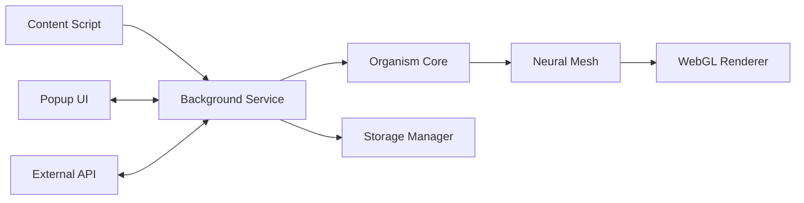

# Guide Développeur SYMBIONT

**Version:** 1.0  
**Date:** Août 2025  
**Environnement:** Production Ready

## 🚀 Introduction

Bienvenue dans l'écosystème de développement SYMBIONT ! Ce guide vous accompagnera dans la configuration, le développement et le déploiement de l'extension Chrome d'organismes intelligents évolutifs.

SYMBIONT est une extension Chrome avancée qui combine :
- **Intelligence Artificielle** comportementale et apprentissage adaptatif
- **Rendu 3D WebGL** pour la visualisation d'organismes
- **Réseau P2P** pour les interactions sociales
- **Sécurité cryptographique** et respect de la vie privée
- **Architecture résiliente** avec monitoring prédictif

## 📋 Prérequis

### Environnement de Développement
```bash
# Node.js LTS
node --version  # ≥ 18.0.0
npm --version   # ≥ 9.0.0

# Git
git --version  # ≥ 2.30.0

# Chrome/Chromium pour tests
google-chrome --version  # ≥ 90.0.0
```

### Outils Recommandés
- **IDE:** Visual Studio Code avec extensions TypeScript
- **Terminal:** Bash/Zsh avec support Unicode
- **Navigateur:** Chrome Dev Channel pour tests avancés
- **Docker:** Pour tests d'intégration backend (optionnel)

## 🛠️ Installation & Configuration

### 1. Clonage du Projet
```bash
git clone https://github.com/pinfada/SYMBIONT.git
cd SYMBIONT

# Vérification de l'intégrité
git log --oneline -5  # Voir les derniers commits
git status            # Vérifier l'état du repository
```

### 2. Installation des Dépendances
```bash
# Installation des dépendances principales
npm install

# Installation dépendances backend (optionnel)
cd backend && npm install && cd ..

# Vérification installation
npm list --depth=0
```

### 3. Configuration Environnement

#### Fichiers d'Environnement
```bash
# Copie des fichiers d'environnement
cp .env.example .env

# Configuration backend (si utilisé)
cd backend && cp .env.example .env && cd ..
```

#### Variables d'Environnement Critiques
```bash
# .env (développement)
NODE_ENV=development
SYMBIONT_DEBUG=true
SHOW_PERFORMANCE_LOGS=true

# Sécurité
ENABLE_SECURE_RANDOM=true
ENABLE_SECURE_LOGGING=true
CRYPTO_KEY_SIZE=256

# Performance
WEBGL_OPTIMIZATION=true
NEURAL_WORKER_THREADS=4

# Social
ENABLE_P2P_NETWORKING=true
MAX_PEER_CONNECTIONS=10
```

### 4. Validation de l'Installation
```bash
# Test de l'environnement
node scripts/validate-environment.js

# Vérification sécurité
node scripts/validate-security.js

# Tests rapides
npm test -- --testNamePattern="basic" --verbose

# Build initial
npm run build
```

## 🏗️ Architecture du Projet

### Structure des Répertoires
```
SYMBIONT/
├── src/                    # Code source principal
│   ├── background/         # Service Worker (Manifest V3)
│   │   ├── index.ts       # Point d'entrée background
│   │   ├── SecurityManager.ts
│   │   ├── WebGLOrchestrator.ts
│   │   └── services/
│   ├── content/           # Scripts d'injection de contenu
│   │   ├── index.ts
│   │   ├── collectors/    # Collecteurs de données
│   │   └── observers/     # Observateurs DOM
│   ├── popup/             # Interface utilisateur popup
│   │   ├── index.tsx
│   │   ├── components/
│   │   └── services/
│   ├── core/              # Logique métier centrale
│   │   ├── OrganismCore.ts
│   │   ├── NeuralMesh.ts
│   │   ├── services/
│   │   └── storage/
│   ├── shared/            # Utilitaires partagés
│   │   ├── utils/         # SecureRandom, SecureLogger, UUID
│   │   ├── messaging/     # Communication inter-composants
│   │   └── config/
│   └── types/             # Définitions TypeScript
├── backend/               # API Express (optionnel)
│   ├── src/
│   │   ├── server.ts
│   │   ├── routes/
│   │   ├── services/
│   │   └── models/
│   └── prisma/           # Schema base de données
├── __tests__/            # Tests unitaires et intégration
│   ├── setup.ts         # Configuration Jest
│   ├── security/        # Tests sécurité
│   ├── core/           # Tests logique métier
│   └── performance/    # Tests performance
├── tests/              # Tests E2E
│   └── e2e/           # Tests Playwright
├── scripts/           # Scripts utilitaires
├── docs/             # Documentation
└── dist/             # Build artifacts
```

### Flux de Données


## 🔧 Commandes de Développement

### Build & Development
```bash
# Build complet (extension + backend)
npm run build:all

# Build extension uniquement
npm run build

# Mode développement avec watch
npm run dev

# Build backend uniquement
cd backend && npm run build
```

### Tests
```bash
# Tous les tests
npm test

# Tests avec couverture
npm run test:ci

# Tests en mode watch
npm run test:watch

# Tests E2E
npm run test:e2e

# Tests de sécurité
npm test -- __tests__/security/
```

### Linting & Quality
```bash
# Lint TypeScript
npm run lint

# Fix automatique
npm run lint:fix

# Vérification manifest
npm run check-manifest

# Validation sécurité
node scripts/validate-security.js
```

## 🧪 Tests et Debugging

### Configuration Jest
Le projet utilise Jest avec TypeScript :
```javascript
// jest.config.js
module.exports = {
  preset: 'ts-jest',
  testEnvironment: 'jsdom',
  setupFilesAfterEnv: ['<rootDir>/jest.setup.js'],
  collectCoverageFrom: [
    'src/**/*.{ts,tsx}',
    '!src/**/*.d.ts',
  ],
  coverageThreshold: {
    global: {
      branches: 75,
      functions: 80,
      lines: 80,
      statements: 80,
    }
  }
};
```

### Tests de Sécurité
```bash
# Migration Math.random() vers SecureRandom
node scripts/migrate-math-random.js

# Validation complète sécurité
npm run security:audit

# Tests cryptographiques
npm test -- __tests__/security/crypto.test.ts
```

### Debugging Chrome Extension
1. **Background Script** : `chrome://extensions` → "Inspecter les vues"
2. **Content Script** : DevTools de la page → Sources
3. **Popup** : Clic droit sur popup → Inspecter

## 🔒 Sécurité & Bonnes Pratiques

### Patterns de Sécurité Obligatoires

#### Random Numbers
```typescript
// ❌ INTERDIT
Math.random()

// ✅ REQUIS
import { SecureRandom } from '@/shared/utils';
SecureRandom.random()
```

#### Logging
```typescript
// ❌ INTERDIT
console.log('User data:', userData)

// ✅ REQUIS
import { logger } from '@/shared/utils';
logger.info('Processing user data', { count: userData.length }, 'UserService')
```

#### UUID Generation
```typescript
// ❌ INTERDIT
Math.random().toString(36)

// ✅ REQUIS
import { generateSecureUUID } from '@/shared/utils';
const id = generateSecureUUID()
```

### Configuration TypeScript Stricte
```json
{
  "compilerOptions": {
    "strict": true,
    "noUnusedLocals": true,
    "noUnusedParameters": true,
    "exactOptionalPropertyTypes": true,
    "forceConsistentCasingInFileNames": true
  }
}
```

## 🚀 Déploiement et CI/CD

### Pipeline GitHub Actions
```yaml
# .github/workflows/ci.yml
name: CI/CD
on: [push, pull_request]

jobs:
  test:
    runs-on: ubuntu-latest
    steps:
      - uses: actions/checkout@v3
      - uses: actions/setup-node@v3
      - run: npm ci
      - run: npm run lint
      - run: npm test
      - run: npm run build
      - run: npm run test:e2e
```

### Build Production
```bash
# Build optimisé production
NODE_ENV=production npm run build

# Validation pré-déploiement
npm run validate:production

# Package pour Chrome Web Store
npm run package
```

## 📱 Extension Chrome - Spécificités

### Manifest V3
```json
{
  "manifest_version": 3,
  "service_worker": "background.js",
  "content_scripts": [{
    "matches": ["<all_urls>"],
    "js": ["content.js"]
  }],
  "permissions": ["storage", "activeTab"]
}
```

### Communication Inter-Scripts
```typescript
// Content Script → Background
chrome.runtime.sendMessage({
  type: 'EVOLVE_ORGANISM',
  payload: { behaviorData: [...] }
});

// Background → Popup
chrome.tabs.sendMessage(tabId, {
  type: 'UPDATE_UI',
  payload: { state: organismState }
});
```

## 🎨 Interface Utilisateur

### React + TypeScript
```typescript
// Composant exemple
import React from 'react';
import { OrganismState } from '@/types';

interface Props {
  organism: OrganismState;
}

const OrganismViewer: React.FC<Props> = ({ organism }) => {
  return (
    <div className="organism-viewer">
      <canvas ref={canvasRef} />
      <div className="stats">
        Energy: {organism.energy}%
      </div>
    </div>
  );
};
```

### Styling avec Tailwind
```typescript
// Utilisation des classes Tailwind
<div className="bg-gray-900 text-white p-4 rounded-lg">
  <h2 className="text-xl font-bold mb-2">Organism Status</h2>
</div>
```

## 🔄 Workflow de Contribution

### 1. Setup Feature Branch
```bash
# Créer branche feature
git checkout -b feature/nouvelle-fonctionnalite

# Sync avec main
git pull origin main
```

### 2. Développement
```bash
# Tests continus
npm run test:watch

# Lint en continu
npm run dev  # Inclut linting automatique
```

### 3. Commit et Push
```bash
# Conventional Commits
git commit -m "feat(neural): add hebbian learning algorithm"
git push origin feature/nouvelle-fonctionnalite
```

### 4. Code Review
- **Automatique:** Pipeline CI/CD vérifie qualité
- **Manuel:** Review par équipe sécurité si changements crypto
- **Validation:** Tests E2E réussis sur multiple navigateurs

## 📊 Monitoring et Métriques

### Performance Monitoring
```typescript
// Monitoring des performances
import { PerformanceMonitor } from '@/shared/utils';

const monitor = new PerformanceMonitor();
monitor.startTimer('neural-processing');
// ... traitement
monitor.endTimer('neural-processing');
```

### Métriques de Santé
- **CPU Usage** : < 5% en moyenne
- **Memory Usage** : < 50MB pour l'extension
- **Response Time** : < 100ms pour interactions UI
- **Error Rate** : < 0.1% sur opérations critiques

## 🛠️ Dépannage Courant

### Problèmes de Build
```bash
# Nettoyage complet
rm -rf node_modules dist
npm install
npm run build
```

### Problèmes TypeScript
```bash
# Vérification des types
npx tsc --noEmit

# Génération des déclarations
npx tsc --declaration --emitDeclarationOnly
```

### Problèmes WebGL
```bash
# Test WebGL dans le navigateur
open chrome://gpu

# Logs WebGL détaillés
SYMBIONT_DEBUG=true npm run dev
```

## 📚 Ressources et Références

### Documentation Interne
- **[Architecture](Architecture)** : Design et structure du système
- **[API Reference](API-Reference)** : Documentation API complète
- **[Security Guide](Security)** : Sécurité et bonnes pratiques

### Ressources Externes
- **Chrome Extensions** : [Developer Documentation](https://developer.chrome.com/docs/extensions/)
- **WebGL** : [MDN WebGL Guide](https://developer.mozilla.org/en-US/docs/Web/API/WebGL_API)
- **TypeScript** : [Handbook](https://www.typescriptlang.org/docs/)
- **React** : [Documentation](https://react.dev/)

### Support Communauté
- **GitHub Issues** : [Repository Issues](https://github.com/pinfada/SYMBIONT/issues)
- **Discussions** : [GitHub Discussions](https://github.com/pinfada/SYMBIONT/discussions)

## 📞 Support et Contact

### Pour les Développeurs
- **Issues Techniques** : [GitHub Issues](https://github.com/pinfada/SYMBIONT/issues)
- **Questions Générales** : [Discussions](https://github.com/pinfada/SYMBIONT/discussions)
- **Contributions** : Voir [Contributing Guide](Contributing)

### Ressources d'Aide
- **[Troubleshooting](Troubleshooting)** : Guide de dépannage technique
- **[FAQ](FAQ)** : Questions fréquemment posées
- **[Performance](Performance)** : Optimisation et profiling

---

**Prêt à contribuer à SYMBIONT ?** 🚀

[**➡️ Voir le Guide de Contribution**](Contributing) | [**🏗️ Architecture Détaillée**](Architecture)